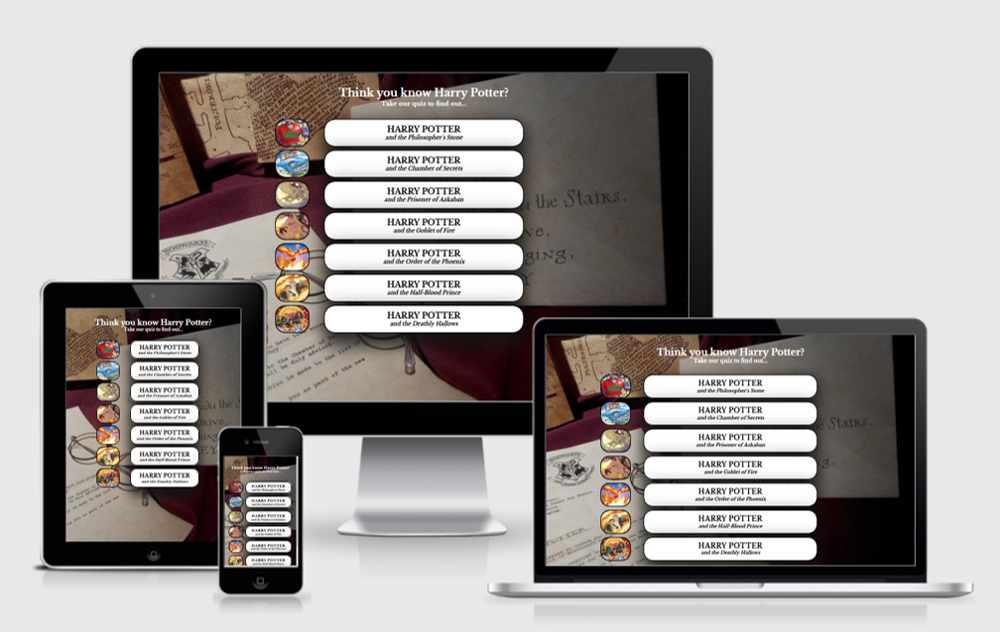
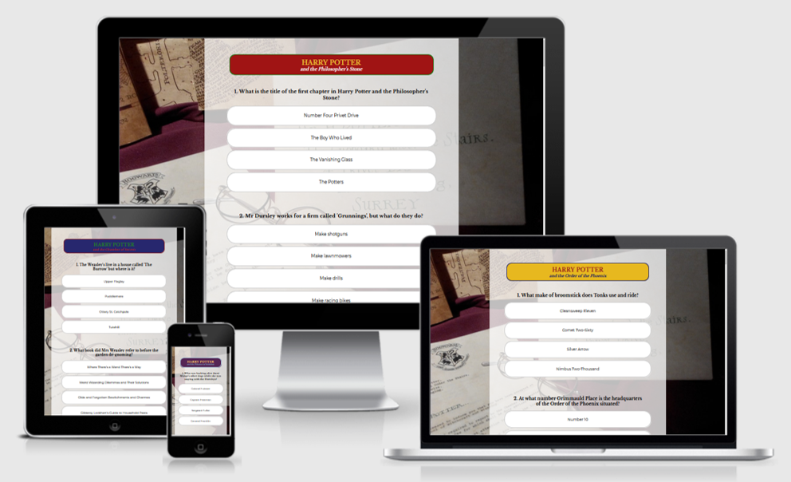
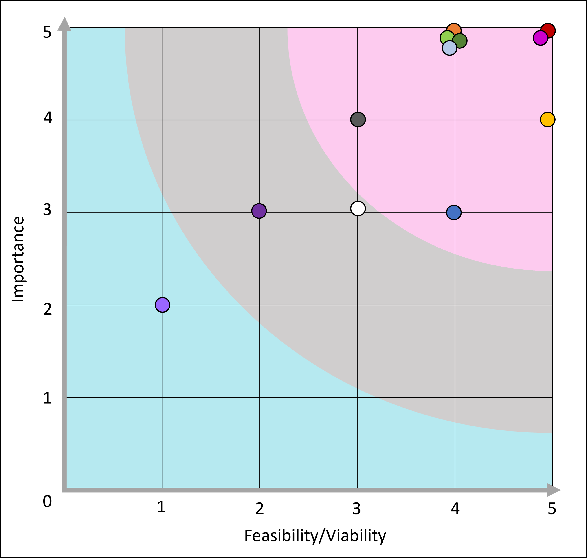
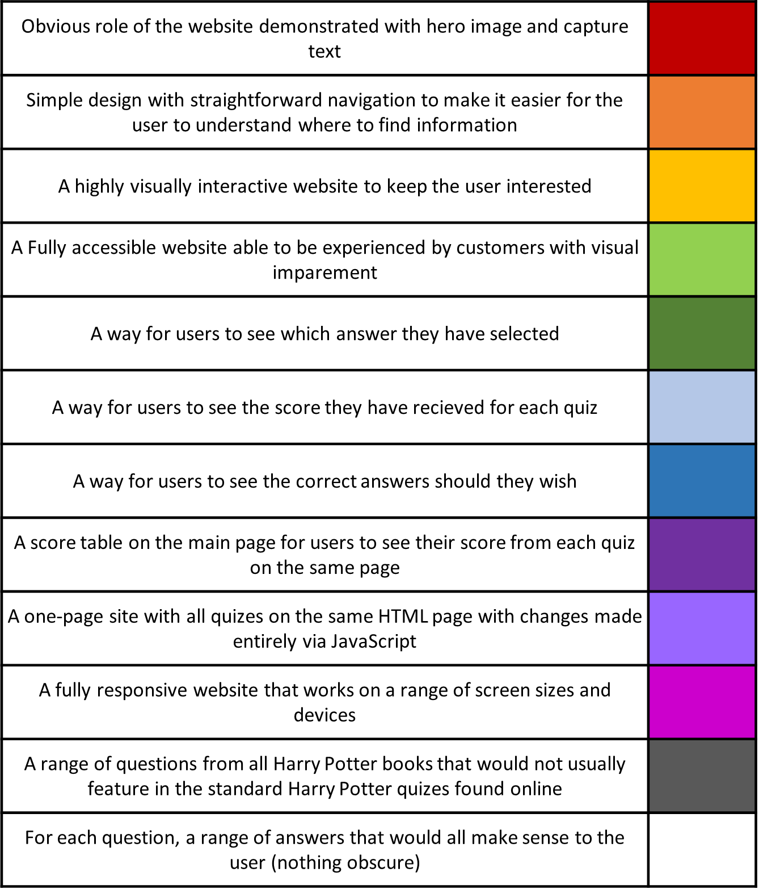
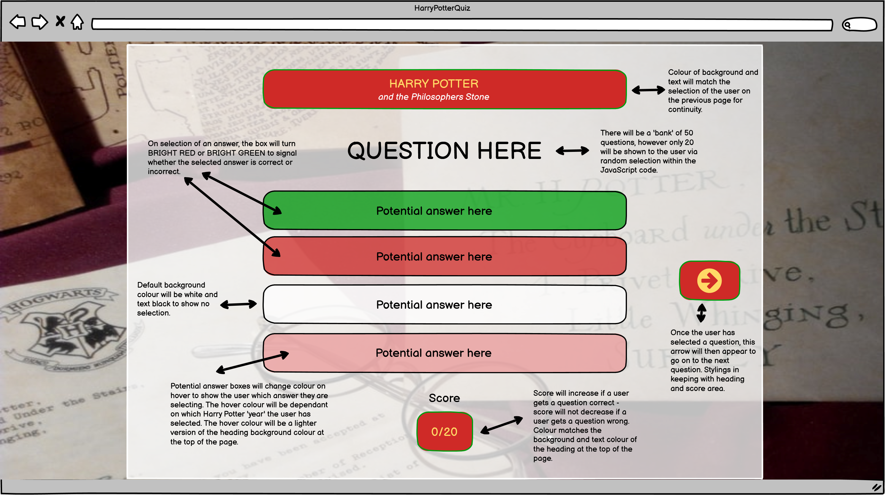
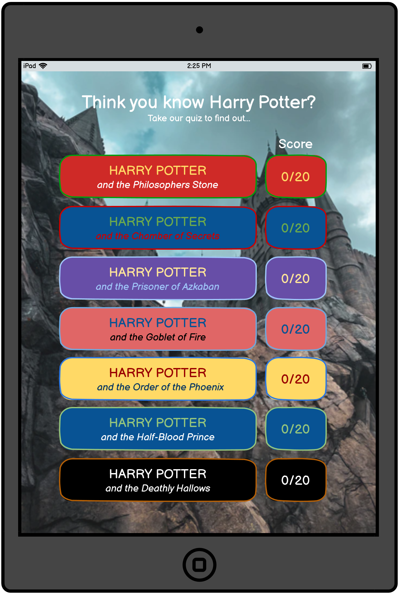
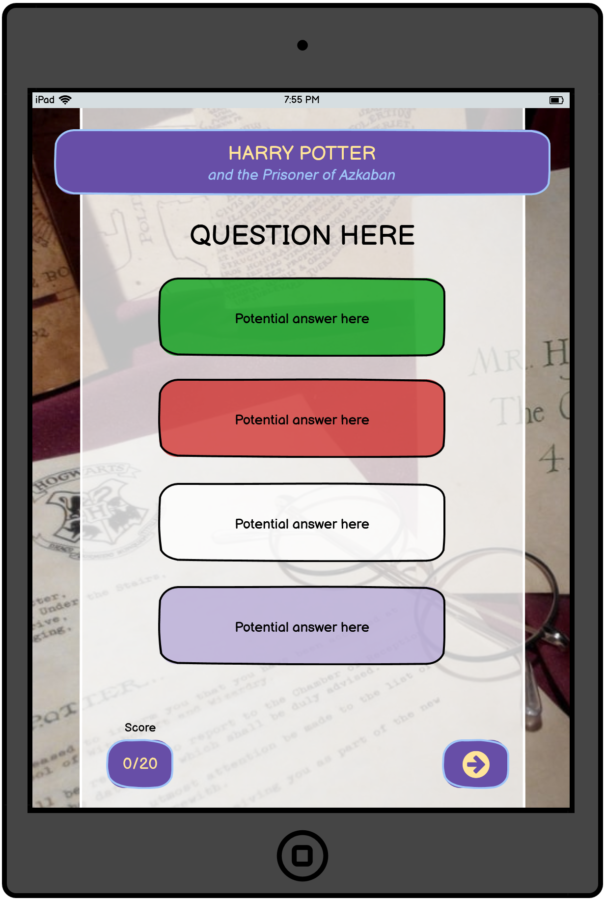
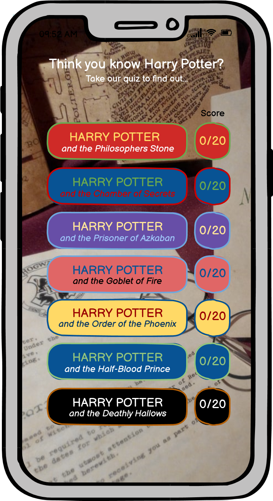
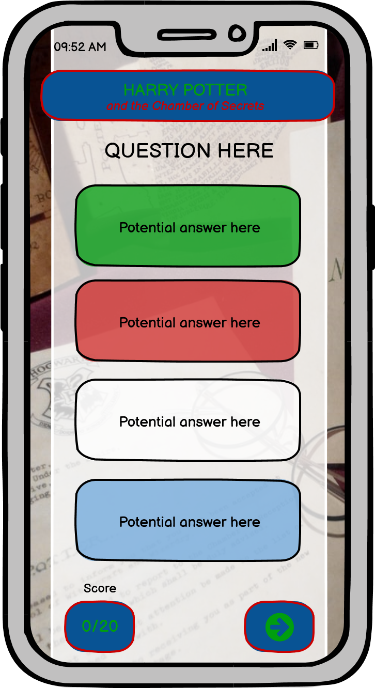
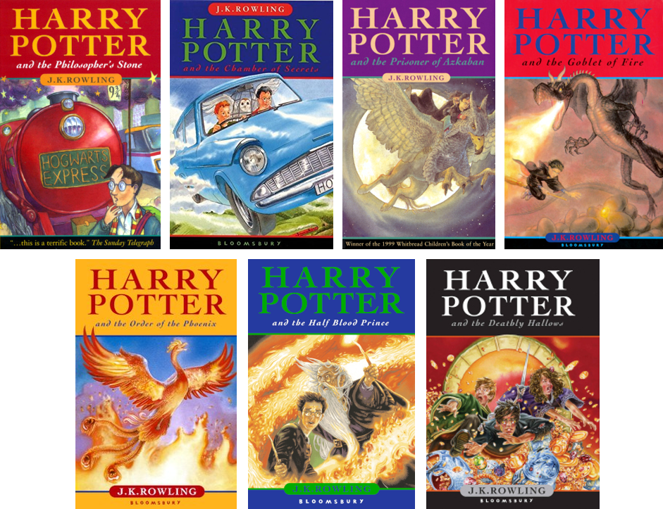

<a href="https://deannacarina.github.io/HarryPotterQuiz/" target="_blank"><h1>Harry Potter Quiz</h1></a>

## Contents
<ul>
    <li>
        <a href="#Introduction"><strong>Introduction</strong></a>
    </li>
    <li>
        <a href="#UX"><strong>UX</strong></a>               
    </li>
    <li>
        <a href="#Technologies"><strong>Technologies</strong></a>
    </li>
    <li>
        <a href="#Features"><strong>Features</strong></a>
    </li>
    <li>
        <a href="#Testing"><strong>Testing</strong></a>   
    </li>
    <li>
        <a href="#Deployment"><strong>Deployment</strong></a>
    </li>
    <li>
       <a href="#Credits"><strong>Credits</strong></a> 
    </li>
    <li>
        <a href="#Screenshots"><strong>Screenshots</strong></a>
    </li>
</ul>

# Introduction
Portfolio Project Two: JavaScript (with HTML and CSS) - Code Institute - Deadline 12th August 2021

This is my submission for Code Institute's (5P) Portfolio Project Two. It will be a quiz website aimed at the Harry Potter fanbase. The website content will be created with HTML, the website will be styled with the use of CSS, and it's functionality will come from the implementation of JavaScript. I will also employ the use of many other <a href="#Technologies">technologies</a>. The website's main function is to be a fun and interactive experience for users who are fans of the Harry Potter franchise. The website will consist of the main landing page which will direct the user to specific quizzes separated by Harry Potter books - One quiz for each book, seven quizzes in total. When a user selects a specific book, the website will direct the user to that specific quiz. As the user completes each quiz, there will be a score tally at the bottom.

### Demo

A live demo of the website can be found <a href="https://deannacarina.github.io/HarryPotterQuiz/" target="_blank"><strong>HERE</strong></a>  

# UX
### Introduction
The five planes provide a conceptual framework for breaking down the task of designing experiences into component elements so that we can understand the problem as a whole. I used this framework for my first Portfolio Project for Code Institute and found it to be structured, easy to follow and helped in breaking down the tasks needed to design and implement a user friendly and interactive website; therefore I will be using the same framework again to design and implement this project.
### Strategy
#### Vision
The Harry Potter Quiz is an interactive website focusing on the more obscure facts and details of the Harry Potter books that only the more 'dedicated' fans would know.
The Harry Potter franchise has a huge and dedicated fan-base, the term 'Pottermania' was a term first used around 1999 to describe the craze that Harry Potter fans have had over the series [2], and 'Potterheads' has also become a term used by many to describe diehard fans of the series. According to Pottermore, there have been more than 500million Harry Potter books sold worldwide [3], which means that at least one in 15 people in the world owns at least one Harry Potter book. As a huge Harry Potter fan myself, I have looked online for quizzes to test my Harry Potter knowledge, and have found myself dissapointed at the lack of challenge they give! When you consistely score 100% on every Harry Potter quiz you find, the challenge rather becomes to find a quiz that will <strong>ACTUALLY</strong> challenge you. Therefore I hope this web-quiz will appeal to those 'Potterheads' that want to challenge themselves and test whether they really do 'know Harry Potter'.

#### Aims
<ol>
    <li>To earn comission from potential companies that would like to advertise via the website in the space left on the main page</li>
    <li>For visitors to the website to have a positive user experience, in terms of website design and interactivity</li>
    <li>To be easily find-able via search engines</li>
    <li>To educate users on the more unusual facts around the Harry Potter books</li>
    <li>To encourage users to re-read the Harry Potter books and increase their knowledge</li>
    <li>To make the site intuative and easily usable to enable customers learn about Harry Potter</li>
</ol>

#### Target Audience

There are a number of target audiences for this website due to the range diverse nature of the Harry Potter fanbase. Harry Potter is considered one of the few four-quadrant, multi-generation spanning franchises that exist today [4] according to the Hollywood Movie Industry, which means that it appeals to:

<ul>
    <li>Males</li>
    <li>Females</li>
    <li>Under 25s</li>
    <li>Over 25s</li>
</ul>

This four-quadrant theory means that I must make the web-quiz accessible to everyone, and have it appeal to anyone that visits no matter their age, gender, ethnicity, or other demographic characteristics and features.

#### User Stories

<strong>As a new AND returning customer I want to...</strong>
<ul>
    <li>Know the purpose of the website as soon as I navigate to the home/landing page</li>
    <li>Navigate the website quickly and effectively</li>
    <li>Quickly find the relevant quiz I wish to attempt</li>
    <li>Have a visual aid to confirm which answer I have chosen</li>
    <li>Get a score at the end of each quiz to show how well I did</li>
    <li>Have an option to show the correct answers in case I don't want to see them and want to retry, or want to retry with some help</li>
    <li>Have interesting and obscure questions about areas of Harry Potter that might not be well-known</li>
</ul>

<strong>As the business operator I want to...</strong>
<ul>
    <li>Ensure the website is easily maintainable by software developers by having intutitive and neat code</li>
    <li>Have any media content displayed in the website accessible at all times via a linked file system</li>
    <li>Ensure all navigation links (internal or external) are always fully functional for ease of use</li>
    <li>Ensure the website is fully accessible to users that may have visual imparement</li>
    <li>Stand out from other forms of online Harry Potter quiz, by being easy to use and well-structured</li>
</ul>

#### What's in and what's out?

<table>
    <tr>
        <th>Opportunity/Feature</th>
        <th>Feasibility/Viability (score out of 5)</th>
        <th>Level of Importance (score out of 5)</th>
        <th>In or out?</th>
    </tr>
    <tr>
        <td>Obvious role of the website demonstrated with hero image and capture text</td>
        <td>5</td>
        <td>5</td>
        <td>In</td>
    </tr>
    <tr>
        <td>Simple design with straightforward navigation to make it easier for the user to understand where to find information</td>
        <td>4</td>
        <td>5</td>
        <td>In</td>
    </tr>
    <tr>
        <td>A highly visually interactive website to keep the user interested</td>
        <td>5</td>
        <td>4</td>
        <td>In</td>
    </tr>
    <tr>
        <td>A Fully accessible website able to be experienced by customers with visual imparement</td>
        <td>4</td>
        <td>5</td>
        <td>In</td>
    </tr>
    <tr>
        <td>A way for users to see which answer they have selected</td>
        <td>4</td>
        <td>5</td>
        <td>In</td>
    </tr>
    <tr>
        <td>A way for users to see the score they have recieved for each quiz</td>
        <td>4</td>
        <td>5</td>
        <td>In</td>
    </tr>
    <tr>
        <td>A way for users to see the correct answers should they wish</td>
        <td>3</td>
        <td>4</td>
        <td>In</td>
    </tr>
    <tr>
        <td>A score table on the main page for users to see their score from each quiz on the same page</td>
        <td>2</td>
        <td>3</td>
        <td>Out</td>
    </tr>
    <tr>
        <td>A one-page site with all quizes on the same HTML page with changes made entirely via JavaScript</td>
        <td>1</td>
        <td>2</td>
        <td>Out</td>
    </tr>
    <tr>
        <td>A fully responsive website that works on a range of screen sizes and devices</td>
        <td>5</td>
        <td>5</td>
        <td>In</td>
    </tr>
    <tr>
        <td>A range of questions from all Harry Potter books that would not usually feature in the standard Harry Potter quizes found online</td>
        <td>3</td>
        <td>4</td>
        <td>In</td>
    </tr>
    <tr>
        <td>For each question, a range of answers that would all make sense to the user (nothing obscure)</td>
        <td>3</td>
        <td>3</td>
        <td>In</td>
    </tr>
    <tr>
        <td></td>
        <td>Average Viability x number of features: 43</td>
        <td>Sum of Importance: 50</td>
        <td></td>
    </tr>
</table> 
As we can see from the table above, the importance is higher than the viability, which which means that I may run into some problems during the implementation of the web-quiz a there will be things that I would like to implement but I would not have the means or knowledge to implement them. Therefore the web-quiz will take a more basic layout, and I will work within the confines of my very limited JavaScript Knowledge to acheive the main goals I have set myself. 
I have plotted the table above into a graph to easily visualise the features that will be implemented into the website and which ones won't be:
<ul>
    <li>The features in the pink section will be implemented</li>
    <li>The features in the grey section could be implemented at a later date but aren't necessary right now</li>
    <li>The features in the turquoise section will not be implemented as it would be unwise to focus on these features until a later date</li>
</ul> 
 
  
<a href="#Contents">Back to the top.</a>

### Scope
### Structure

### Skeleton

The wireframes for the Harry Potter Quiz website were made with the Balsamiq Desktop Applictaion, they can be found by viewing the images below. As the layout of the quiz will change between device screen sizes, I have made a wireframe for all devices; with PC being in landscape, and tablet and phones being in portrait orientation. As I have chosen an image that is square, it is able to act as the background for all screen sizes, inkeeping with device compatibility and responsiveness.
  
The wireframe below is for the landing page on PC.
  
The wireframe below is for the quiz page on PC.
  
The wireframes below are for tablets. 
 
  
The wireframes below are for smaller devices. 
 

  

### Surface

#### Colour Scheme
The main colours used on the website are the links for the specific quizes (organised by Harry Potter book - one for each quiz.) These colours match the colours that are on the front of each book. I felt this would add familiarity for the user as the majority of visitors to the website will be Harry Potter fans. These were determined during the wireframe stage as I feel the colour scheme is a massive part of what keeps the user interested and more likely to stay on the website.  
  
During development of the website, I felt that having so many colours on the main page would distract the user and encourage them to navigate away due to information overload. As such, I have made the div-links to the quiz pages very neutral in colour; however I have kept the original colour scheme on the scores as I still like the idea of colour continuity - and these colours match the colours used on the separate quiz pages.

# Technologies
### Languages
### Version Control
### Applications
### Frameworks, Libraries and Programs

# Features
### Deciding what to implement
### Implemented features
### Features left to implement

# Testing
### Introduction
### Functionality
### Compatibility
### User Testing Stories
### Code Validation
### Peer Review
### Development Problems
### Accessibility
### Performance Testing
### Bugs (and their fixes)
<ul>
    <li>Unable to duplicate answers within the same JS file due to using the answers themselves as selector ID's in the CSS. In order to make the answers selectable, each one had to have a unique ID - I found the easiest way to generate these unique ID's was to make the answer themselves the ID, however I found that when I did this, if there were duplicate answers in the quiz, the duplicate answer would be selected when the orginal answer was selected. To minimise the risk of this happening, I chose to split the JavaScript files containing the questions and answers into seven separate files as the chances of duplicating answers over 20 questions is far less than the chances of duplicating them over 140. I am aware that I am not following the DRY (don't repeat yourself) priniciple when I do this, however to minimise bugs, and to fix bugs that arose in the development of the website, I found that I actually preferred having these separate JavaScript files as I knew exactly where the bug would be and how to fix it.</li>
    <li>User can scroll to the bottom of the quiz page as soon as they navigate to it, click on 'Get results' which will return a score of 0/20, then click on 'Reveal answers' which will reveal all the correct answers, the user then can change their answers and re-submitt for a top score. To fix this there is the option to disable interaction with the answers after the 'get results' button is clicked, however I feel that there's not much point in doing this as users can cheat regardless of whether they can re-submit or not. If the answers were disabled on click of 'get answers' then all the user would need to do is note down the questions they got wrong with the correct answers, then re-try the quiz. Unfortunately there will always be people that cheat, and there isn't much that we can do about this, however I am hoping that the people that this quiz is targetted towards would complete the quiz without cheating for the personal satisfaction of knowing they have top-knowledge of the Harry Potter books.</li>
</ul>

# Deployment
### Project Creation
### Project Deployment
### Local Deployment

# Credits

### Code
### Content

#### Images
There is only one image used throughout the website - which is the background image used for different screen sizes - this image came from <a href="https://unsplash.com/" target="_blank">Unsplash</a>:
<ul>
    <li>
        <a href="https://unsplash.com/photos/WE7YfTGpXlg" target="_blank">Rae Tian</a> - background image for portrait and landscape orientation on all devices.
    </li>
</ul>    

#### Acknowledgements

# Screenshots
