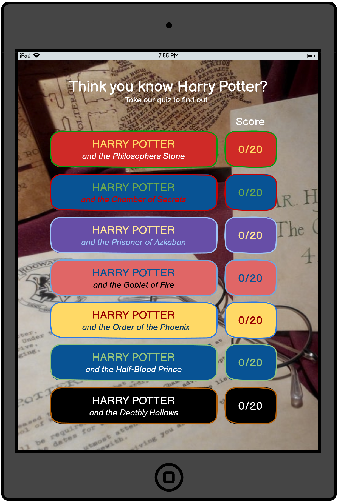

<a href="#" target="_blank"><h1>Harry Potter Quiz</h1></a>

## Contents
<ul>
    <li>
        <a href="#Introduction"><strong>Introduction</strong></a>
    </li>
    <li>
        <a href="#UX"><strong>UX</strong></a>               
    </li>
    <li>
        <a href="#Technologies"><strong>Technologies</strong></a>
    </li>
    <li>
        <a href="#Features"><strong>Features</strong></a>
    </li>
    <li>
        <a href="#Testing"><strong>Testing</strong></a>   
    </li>
    <li>
        <a href="#Deployment"><strong>Deployment</strong></a>
    </li>
    <li>
       <a href="#Credits"><strong>Credits</strong></a> 
    </li>
    <li>
        <a href="#Screenshots"><strong>Screenshots</strong></a>
    </li>
</ul>

# Introduction
Portfolio Project Two: JavaScript (with HTML and CSS) - Code Institute - Deadline 12th August 2021

This is my submission for Code Institute's (5P) Portfolio Project Two. It will be a quiz website aimed at the Harry Potter fanbase. The website content will be created with HTML, the website will be styled with the use of CSS, and it's functionality will come from the implementation of JavaScript. I will also employ the use of many other <a href="#Technologies">technologies</a>. The website's main function is to be a fun and interactive experience for users who are fans of the Harry Potter franchise. The website will consist of the main landing page which will direct the user to specific quizzes separated by Harry Potter books - One quiz for each book, seven quizzes in total. When a user selects a specific book, the website will direct the user to that specific quiz. As the user completes each quiz, there will be a score tally at the bottom, and the score will also update on the main landing page.

# Skeleton

The wireframes for the Harry Potter Quiz website were made with the Balsamiq Desktop Applictaion, they can be found by viewing the images below. As the layout of the quiz will change between device screen sizes, I have made a wireframe for all devices; with PC being in landscape, and tablet and phones being in portrait orientation. As I have chosen an image that is square, it is able to act as the background for all screen sizes, inkeeping with device compatibility and responsiveness.
  
The wireframe below is for the landing page on PC.
  
The wireframe below is for the quiz page on PC.
  
The wireframes below are for tablets. 
 
  
The wireframes below are for smaller devices. 
 

  

# Surface

### Colour Scheme
The main colours used on the website are the links for the specific quizes (organised by Harry Potter book - one for each quiz.) These colours match the colours that are on the front of each book. I felt this would add familiarity for the user as the majority of visitors to the website will be Harry Potter fans. These were determined during the wireframe stage as I feel the colour scheme is a massive part of what keeps the user interested and more likely to stay on the website.  
  
During development of the website, I felt that having so many colours on the main page would distract the user and encourage them to navigate away due to information overload. As such, I have made the div-links to the quiz pages very neutral in colour; however I have kept the original colour scheme on the scores as I still like the idea of colour continuity - and these colours match the colours used on the separate quiz pages.

# Credits

## Content

## Images
There is only one image used throughout the website - which is the background image used for different screen sizes - this image came from <a href="https://unsplash.com/" target="_blank">Unsplash</a>:
<ul>
    <li>
        <a href="https://unsplash.com/photos/WE7YfTGpXlg" target="_blank">Rae Tian</a> - background image for portrait and landscape orientation on all devices.
    </li>
</ul>    

## Acknowledgements

# Screenshots
