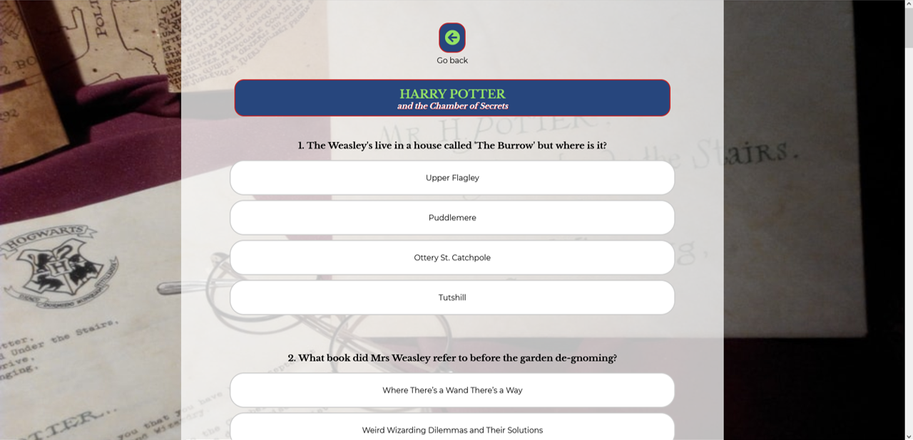
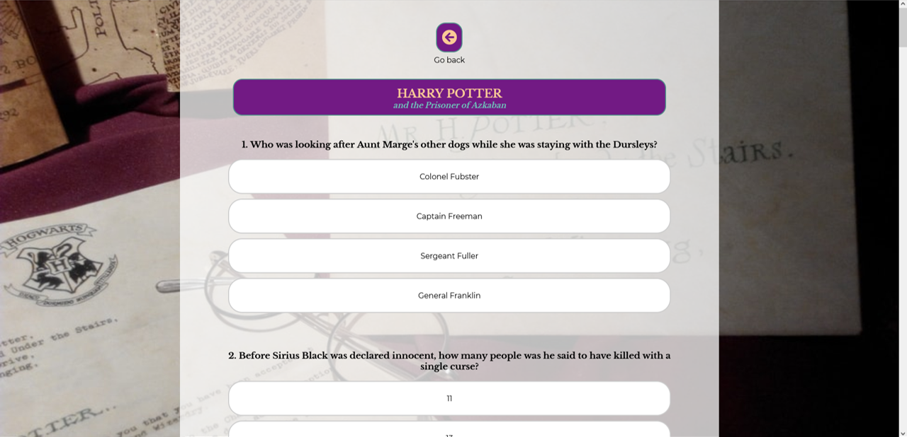

<a href="https://deannacarina.github.io/HarryPotterQuiz/" target="_blank"><h1>Harry Potter Quiz</h1></a>

**Please note**: The following README follows the same layout and logic as the README from my previous project, there will be similarities in text.

## Contents
<ul>
    <li>
        <a href="#Introduction"><strong>Introduction</strong></a>
    </li>
    <li>
        <a href="#UX"><strong>UX</strong></a>               
    </li>
    <li>
        <a href="#Technologies"><strong>Technologies</strong></a>
    </li>
    <li>
        <a href="#Features"><strong>Features</strong></a>
    </li>
    <li>
        <a href="#Testing"><strong>Testing</strong></a>   
    </li>
    <li>
        <a href="#Deployment"><strong>Deployment</strong></a>
    </li>
    <li>
       <a href="#Credits"><strong>Credits</strong></a> 
    </li>
    <li>
        <a href="#Screenshots"><strong>Screenshots</strong></a>
    </li>
    <li>
        <a href="#References"><strong>References</strong></a>
    </li>
</ul>

# Introduction
Portfolio Project Two: JavaScript (with HTML and CSS) - Code Institute - Deadline 12th August 2021

This is my submission for Code Institute's (5P) Portfolio Project Two. It will be a quiz website aimed at the Harry Potter fanbase. The website content will be created with HTML, the website will be styled with the use of CSS, and it's functionality will come from the implementation of JavaScript. I will also employ the use of many other <a href="#Technologies">technologies</a>. The website's main function is to be a fun and interactive experience for users who are fans of the Harry Potter franchise. The website will consist of the main landing page which will direct the user to specific quizzes separated by Harry Potter books - One quiz for each book, seven quizzes in total. When a user selects a specific book, the website will direct the user to that specific quiz. As the user completes each quiz, there will be a score tally at the bottom.

### Demo

A live demo of the website can be found <a href="https://deannacarina.github.io/HarryPotterQuiz/" target="_blank"><strong>HERE</strong></a>  
 
<a href="#Contents">Back to the top.</a>

### UX
Please click<a href="assets/documents/ux.md" target="_blank"><stong> *HERE* </stong></a> for the UX section of the README.

### Technologies
Please click<a href="assets/documents/technologies.md" target="_blank"><stong> *HERE* </stong></a> for the technologies section of the README.

### Features
Please click<a href="assets/documents/features.md" target="_blank"><stong> *HERE* </stong></a> for the features section of the README.

### Testing
Please click<a href="assets/documents/testing.md" target="_blank"><stong> *HERE* </stong></a> for the testing section of the README.

### Deployment
Please click<a href="assets/documents/deployment.md" target="_blank"><stong> *HERE* </stong></a> for the deployment section of the README.

### Credits

### Code
<ul>
    <li><a href="https://www.w3schools.com/howto/howto_css_modals.asp">How TO - CSS/JS Modal</a></li>
    <li><a href="https://simplestepscode.com/javascript-quiz-tutorial/">How to make a simple JavaScript quiz</a></li>
</ul>
The first tutorial was used for the modal on the main page for users to view the instructions without having to navigate to a new page, and the second was used for the base code on the quiz pages. Both sets of code have been edited to fit the needs of the Harry Potter Quiz website. I wish I could have written all of the JavaScript code independently, however I felt that using some pre-made code that already did (almost) what I needed it to, would improve the standard of code, decrease the chance of potential bugs and allow me to work within the timeframe to meet the deadline for the project. I was able to edit and add things to the code as and when I needed to be able to make the web-quiz interactivity how I had imagined it during the planning phase.

### Content
All questions and answers in the web-quiz were found and worded by myself (please see implemented features points 9 and 10). Some of the alternate answers I found from websites like <a href="https://en.wikipedia.org/wiki/Harry_Potter" target="_blank">Wikipedia</a>, <a href="https://harrypotter.fandom.com/wiki/Harry_Potter" target="_blank">Harry Potter Fandom</a> and <a href="https://www.wizardingworld.com/" target="_blank">Wizarding World</a>.

#### Images
The main image used throughout the website - the background image used for different screen sizes came from <a href="https://unsplash.com/" target="_blank">Unsplash</a>:
<ul>
    <li>
        <a href="https://unsplash.com/photos/WE7YfTGpXlg" target="_blank">Rae Tian</a> - background image for portrait and landscape orientation on all devices.
    </li>
</ul> 

#### Acknowledgements
<ul>
    <li>Once again, to my absolutely amazing Fiancé - you are my rock and without you I would have thrown in the towel.</li>
</ul>
<a href="#Contents">Back to the top.</a>

# Screenshots

  
<a href="#Contents">Back to the top.</a>

# References

[1]"Harry Potter fandom - Wikipedia", En.wikipedia.org, 2021. [Online]. Available: https://en.wikipedia.org/wiki/Harry_Potter_fandom. [Accessed: 30- Jul- 2021].

[2]S. Reid, ""Harry Potter" Hits 500 Million Worldwide Sales | MuggleNet", MuggleNet, 2021. [Online]. Available: https://www.mugglenet.com/2018/02/harry-potter-hits-500-million-worldwide-sales/. [Accessed: 30- Jul- 2021].

[3]"Harry Potter fandom - Wikipedia", En.wikipedia.org, 2021. [Online]. Available: https://en.wikipedia.org/wiki/Harry_Potter_fandom. [Accessed: 30- Jul- 2021].

[4]"Accessibility Basics | Usability.gov", Usability.gov, 2021. [Online]. Available: https://www.usability.gov/what-and-why/accessibility.html. [Accessed: 12- Jun- 2021].