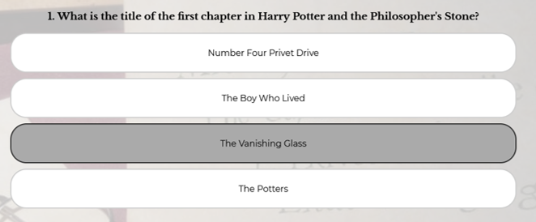
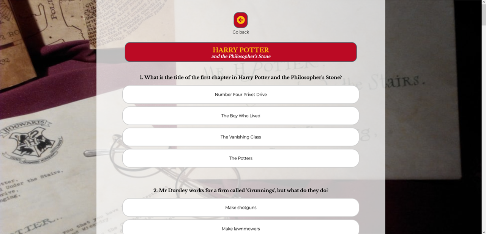

<a href="https://deannacarina.github.io/HarryPotterQuiz/" target="_blank"><h1>Harry Potter Quiz</h1></a>

**Please note**: The following README follows the same layout and logic as the README from my previous project, there will be similarities in text.

## Contents
<ul>
    <li>
        <a href="#Introduction"><strong>Introduction</strong></a>
    </li>
    <li>
        <a href="#UX"><strong>UX</strong></a>               
    </li>
    <li>
        <a href="#Technologies"><strong>Technologies</strong></a>
    </li>
    <li>
        <a href="#Features"><strong>Features</strong></a>
    </li>
    <li>
        <a href="#Testing"><strong>Testing</strong></a>   
    </li>
    <li>
        <a href="#Deployment"><strong>Deployment</strong></a>
    </li>
    <li>
       <a href="#Credits"><strong>Credits</strong></a> 
    </li>
    <li>
        <a href="#Screenshots"><strong>Screenshots</strong></a>
    </li>
    <li>
        <a href="#References"><strong>References</strong></a>
    </li>
</ul>

# Introduction
Portfolio Project Two: JavaScript (with HTML and CSS) - Code Institute - Deadline 12th August 2021

This is my submission for Code Institute's (5P) Portfolio Project Two. It will be a quiz website aimed at the Harry Potter fanbase. The website content will be created with HTML, the website will be styled with the use of CSS, and it's functionality will come from the implementation of JavaScript. I will also employ the use of many other <a href="#Technologies">technologies</a>. The website's main function is to be a fun and interactive experience for users who are fans of the Harry Potter franchise. The website will consist of the main landing page which will direct the user to specific quizzes separated by Harry Potter books - One quiz for each book, seven quizzes in total. When a user selects a specific book, the website will direct the user to that specific quiz. As the user completes each quiz, there will be a score tally at the bottom.

### Demo

A live demo of the website can be found <a href="https://deannacarina.github.io/HarryPotterQuiz/" target="_blank"><strong>HERE</strong></a>  
 
<a href="#Contents">Back to the top.</a>

# UX
### Introduction
The five planes provide a conceptual framework for breaking down the task of designing experiences into component elements so that we can understand the problem as a whole. I used this framework for my first Portfolio Project for Code Institute and found it to be structured, easy to follow and helped in breaking down the tasks needed to design and implement a user friendly and interactive website; therefore I will be using the same framework again to design and implement this project.
### Strategy
#### Vision
The Harry Potter Quiz is an interactive website focusing on the more obscure facts and details of the Harry Potter books that only the more 'dedicated' fans would know.
The Harry Potter franchise has a huge and dedicated fan-base, the term 'Pottermania' was a term first used around 1999 to describe the craze that Harry Potter fans have had over the series [1], and 'Potterheads' has also become a term used by many to describe diehard fans of the series. According to Mugglenet, there have been more than 500million Harry Potter books sold worldwide [2], which means that at least one in 15 people in the world owns at least one Harry Potter book. As a huge Harry Potter fan myself, I have looked online for quizzes to test my Harry Potter knowledge, and have found myself dissapointed at the lack of challenge they give! When you consistely score 100% on every Harry Potter quiz you find, the challenge rather becomes to find a quiz that will <strong>ACTUALLY</strong> challenge you. Therefore I hope this web-quiz will appeal to those 'Potterheads' that want to challenge themselves and test whether they really do 'know Harry Potter'.

#### Aims
<ol>
    <li>To supply instructions to the user on how to best 'play' the quiz</li>
    <li>For visitors to the website to have a positive user experience, in terms of website design and interactivity</li>
    <li>To be easily find-able via search engines</li>
    <li>To educate users on the more unusual facts around the Harry Potter books</li>
    <li>To encourage users to re-read the Harry Potter books and increase their knowledge</li>
    <li>To make the site intuative and easily usable to enable customers learn about Harry Potter</li>
    <li>To have easiliy accessible social media platform links</li>
</ol>

#### Target Audience

There are a number of target audiences for this website due to the diverse nature of the Harry Potter fanbase. Harry Potter is considered one of the few four-quadrant, multi-generation spanning franchises that exist today [3] according to the Hollywood Movie Industry, which means that it appeals to:

<ul>
    <li>Males</li>
    <li>Females</li>
    <li>Under 25s</li>
    <li>Over 25s</li>
</ul>

This four-quadrant theory means that I must make the web-quiz accessible to everyone, and have it appeal to anyone that visits no matter their age, gender, ethnicity, or other demographic characteristics and features, as anybody can be a fan of Harry Potter.

#### User Stories

<strong>As a new AND returning user I want to...</strong>
<ul>
    <li>Know the purpose of the website as soon as I navigate to the home/landing page</li>
    <li>Navigate the website quickly and effectively</li>
    <li>Quickly find the relevant quiz I wish to attempt</li>
    <li>Have a visual aid to confirm which answer I have chosen</li>
    <li>Get a score at the end of each quiz to show how well I did</li>
    <li>Have an option to show the correct answers in case I don't want to see them and want to retry, or want to retry with some help</li>
    <li>Have interesting and obscure questions about areas of Harry Potter that might not be well-known</li>
    <li>Have straightforward and easily accessible instructions for the Quiz</li>
</ul>

<strong>As the business operator I want to...</strong>
<ul>
    <li>Ensure the website is easily maintainable by software developers by having intutitive and neat code</li>
    <li>Have any media content displayed in the website accessible at all times via a linked file system</li>
    <li>Ensure all navigation links (internal or external) are always fully functional for ease of use</li>
    <li>Ensure the website is fully accessible to users that may have visual imparement</li>
    <li>Stand out from other forms of online Harry Potter quiz, by being easy to use and well-structured</li>
</ul>

#### What's in and what's out?

<table>
    <tr>
        <th>Opportunity/Feature</th>
        <th>Feasibility/Viability (score out of 5)</th>
        <th>Level of Importance (score out of 5)</th>
        <th>In or out?</th>
    </tr>
    <tr>
        <td>Obvious role of the website demonstrated with hero image and capture text</td>
        <td>5</td>
        <td>5</td>
        <td>In</td>
    </tr>
    <tr>
        <td>Simple design with straightforward navigation to make it easier for the user to understand where to find information</td>
        <td>4</td>
        <td>5</td>
        <td>In</td>
    </tr>
    <tr>
        <td>A highly visually interactive website to keep the user interested</td>
        <td>5</td>
        <td>4</td>
        <td>In</td>
    </tr>
    <tr>
        <td>A Fully accessible website able to be experienced by customers with visual imparement</td>
        <td>4</td>
        <td>5</td>
        <td>In</td>
    </tr>
    <tr>
        <td>A way for users to see which answer they have selected</td>
        <td>4</td>
        <td>5</td>
        <td>In</td>
    </tr>
    <tr>
        <td>A way for users to see the score they have recieved for each quiz</td>
        <td>4</td>
        <td>5</td>
        <td>In</td>
    </tr>
    <tr>
        <td>A way for users to see the correct answers should they wish</td>
        <td>3</td>
        <td>4</td>
        <td>In</td>
    </tr>
    <tr>
        <td>A score table on the main page for users to see their score from each quiz on the same page</td>
        <td>2</td>
        <td>3</td>
        <td>Out</td>
    </tr>
    <tr>
        <td>A one-page site with all quizes on the same HTML page with changes made entirely via JavaScript</td>
        <td>1</td>
        <td>2</td>
        <td>Out</td>
    </tr>
    <tr>
        <td>A fully responsive website that works on a range of screen sizes and devices</td>
        <td>5</td>
        <td>5</td>
        <td>In</td>
    </tr>
    <tr>
        <td>A range of questions from all Harry Potter books that would not usually feature in the standard Harry Potter quizes found online</td>
        <td>3</td>
        <td>4</td>
        <td>In</td>
    </tr>
    <tr>
        <td>For each question, a range of answers that would all make sense to the user (nothing obscure)</td>
        <td>3</td>
        <td>3</td>
        <td>In</td>
    </tr>
    <tr>
        <td></td>
        <td>Average Viability x number of features: 43</td>
        <td>Sum of Importance: 50</td>
        <td></td>
    </tr>
</table> 
As we can see from the table above, the importance is higher than the viability, which which means that I may run into some problems during the implementation of the web-quiz a there will be things that I would like to implement but I would not have the means or knowledge to implement them. Therefore the web-quiz will take a more basic layout, and I will work within the confines of my very limited JavaScript Knowledge to acheive the main goals I have set myself.  
I have plotted the table above into a graph to easily visualise the features that will be implemented into the website and which ones won't be:
<ul>
    <li>The features in the pink section will be implemented</li>
    <li>The features in the grey section could be implemented at a later date but aren't necessary right now</li>
    <li>The features in the turquoise section will not be implemented as it would be unwise to focus on these features until a later date</li>
</ul>

 
For the feature "For each question, a range of answers that would all make sense to the user (nothing obscure)" I am going to aim to implement this feature as this will add to the user experience but also allow me to make the question harder or easier depending on the possible answers there are. For example in Book 1 question 19, I have custom made the answers to all make sense as they are all written in Latin (apart from the correct answer however this also looks like it's written in latin) and all translate to something that would make sense as the answer to the question.
 
<a href="#Contents">Back to the top.</a>

### Scope

Much the same as my previous project for Code Institute, I have chosen to base the development of my product using the MMP (Minimum Marketable Product) as this allows a fully functional application to be used and can implement my aims with the minimum amount of features while still being completely usable.

This however does mean that more time must be spent developing and deploying the application without the guarantee of user satisfaction and possibly result in some 'rough edges' that need to be rectified and de-bugged at a later date. By using this method, any feedback from users will be based on a fully working web-app and result in fully qualitative data due to the product being in a finished state; rather than feedback based on a web-app that has intentionally been left incomplete resulting in feedback from users who may believe the site to be inadaquate due to lack of content and intuitiveness. I have been able to confidently use the MMP model due to my own interest and love for the Harry Potter franchise as well as ownership of all of the Harry Potter books to be able to create the questions and answers for the quiz, I can create the web-quiz based on what I would want as a Harry Potter fan. By incorporating into the website features that I would want to see on web-quizes based on the Harry Potter books, I hope that my wants and needs will translate to the wants and needs of the users and fans visiting the Harry Potter quiz website. 
 
The MMP model will:
<ul>
    <li>Create a clear website with enough content for the users wants and needs to be fulfilled</li>
    <li>Allow me to work within the scope of my abilitiy while also allowing me to challenge myself in areas of coding that I'm not as comfortable with</li>
    <li>Result in a website with high levels of UX</li>
</ul>
While following the MMP model, to meet the user and business goals, my website will include:
<ul>
    <li>A large collection of Harry Potter related questions based on the Harry Potter books</li>
    <li>A straightforward and intuitive navigation system for users to be able to navigate to specific quizzes</li>
    <li>A way for users to find out their score after carrying out a quiz</li>
    <li>A way for users to reveal the correct answers and to easily re-try</li>
</ul>
<a href="#Contents">Back to the top.</a>

### Structure

Much the same as my last project for Code Institute, I have chosen to carry out a non-linear method of design for this website as it consists of multiple pages which might not necessarily be viewed in a particular order as each page has a different role to play. By having multiple pages we can separate large amounts of information into logical sections to make it easier for the user to find what they are looking for. 

On index.html: I chose for the main content of this page to be navigation for the user to be able to select a particular Harry Potter quiz. If the navigation was less obvious then the user might navigate away as they don't know where to click or what to do. The text at the top of the page tells the user the exact role of the website and the topic of the quiz while also issuing a challenge for the user and encouraging them to carry out one of the seven quizzes. This page also contains a button which will show instructions for the user and a footer containing social media links.

On all of the quiz pages: On navigation to all of the quiz pages, an alert will be visible for the user reminding them that all of the questions are based on the Harry Potter books, I felt this was a highly important piece of information for the user to know as many of the potential answers differ based on the Book versus the Movie e.g. Book 1 Question 15: The correct answer for the Book is 'Charms' however the correct answer for the movie is 'Defence Against the Dark Arts' both are potential answers for the question so this question might have caught out many users without the alert. All questions are displayed on the page via the specific JavaScript file, on selection of a single answer, the users selection will highlight in a grey colour, and on hover of any answer it will highlight in a light grey colour. Once all questions have been attempted (or not) and the user selects 'get results' all potential answers for a single question will be highlighted in green or red - this does not show the correct answer, only whether the question has been answered correctly or incorrectly. On selection of the 'get results' button, this will also reveal three further buttons - one to reveal the correct answers, one to refresh the page to try again, and one to go back to the home page (there is also this button at the top of the page). 
<a href="#Contents">Back to the top.</a>

### Skeleton

The wireframes for the Harry Potter Quiz website were made with the Balsamiq Desktop Applictaion, they can be found by viewing the images below. As the layout of the quiz will change between device screen sizes, I have made a wireframe for all devices; with PC being in landscape, and tablet and phones being in portrait orientation. As I have chosen an image that is square, it is able to act as the background for all screen sizes, inkeeping with device compatibility and responsiveness. As the development of the web-quiz is carried out, the final produced developed may differ from these wireframes as I decide which features to implement.
  
The wireframe below is for the landing page on PC.
  
The wireframe below is for the quiz page on PC.
  
The wireframes below are for tablets. 
 
  
The wireframes below are for smaller devices. 
 

 
<a href="#Contents">Back to the top.</a>

### Surface
#### Typography
I used Google Fonts to find the typography that I wanted to use for the website. I wanted to try and find a similar font for the headings as the font for the 'Harry Potter' text on the front covers of the books, I think I managed to find a fairly similar font with 'Libre Baskerville', by using this font I hope that it will add familiarity for the user, but also highlight the design similarities between the website and the books. For the normal website text I used 'Montserrat', this was a font suggested by Google Fonts which I felt was good for the website as it is easy to read. I didn't come across any problems with these fonts during the design and deployment processes.  
  

#### Colour Scheme
 
The main colours used on the website are the headings and navigation links on click of the 'get results' button - these correspond to the colours on the front of the related Harry Potter book.  
  
Initially (as you can see from the wireframes) I had chosen to have the links with these specific colours too, in able to add familiarity for the user, however I felt that having so many colours on the main page would distract the user and encourage them to navigate away due to information overload. As such, I have made the div-links to the quiz pages very neutral in colour and added an image to the left hand side of the nav-link of the front cover image of each Harry Potter book. I generated the colours above by using an eyedropper tool on the front covers of the book images below. 
 
On hover of the answers, the colour changes to a light grey as a visual aid to the user of which answer they are going to click (this can be seen with the first image below), and on click of an answer the background colour goes to a darker grey with a dark grey border as a further visual aid of which answer they have selected - I chose to keep these colours neutral so there is no visual clue as to which answer is correct. The quiz pages all have a transparent background behind the answers to ensure the user is not distracted by the background. I also added a hover psuedo class to the nav links on the main page as a visual aid to which quiz the user is going to click on. 
  
 

#### Icons
The icons used in the website were taken from <a href="https://fontawesome.com/" target="_blank">Font Awesome</a>, they can be seen throughout the site on all quiz pages after the 'get results' button has been clicked. They are used as calls to action for the user to either navigate home, refresh the page or to reveal answers.  
  
The favicon was made by myself using shapes and drawing tools in Microsoft Powerpoint, it was then converted from a png file to an ico file via <a href="https://favicon.io/" target="_blank">Favicon.io</a>.  
 
<a href="#Contents">Back to the top.</a>

#### Design - Images
The main image used on the website is the background image which was taken from Pexels (see credit for photographer information). I wanted a background that would tie in with the theme of the website and also be instantly recognisable by the users. I struggled to find an image that fit my needs while also being fairly neutral in colour so as to not distract from the forground text and elements.   
 
I feel that this image was the best I could find, and to ensure that there is less distraction from it, on the quiz pages I have a white transparent overlay of the majority of the background to enable the user to still see the image without being distracted by it. The only other images used on the website are those of the front cover images on the main page, these were scanned using my home scanner and reduced in size via an image resolution reduction tool online to reduce load times.  
 
<a href="#Contents">Back to the top.</a>

# Technologies
Throughout the planning, design, testing and deployment of the website, I have used a number of technologies:

### Languages
<ol>
    <li><a href="https://en.wikipedia.org/wiki/HTML5" target="_blank">HTML</a>
        <ul><li>The main structure of the website</li></ul>
    </li>
    <li><a href="https://en.wikipedia.org/wiki/CSS" target="_blank">CSS</a>
        <ul><li>For the design of the site</li></ul>
    </li>
    <li><a href="https://en.wikipedia.org/wiki/JavaScript" target="_blank">JavaScript</a>
        <ul><li>For importing the kit from Font Awesome</li>
        <li>For the interactivity of the site and user experience improvement</li></ul>
    </li>
    <li>Limited <a href="https://en.wikipedia.org/wiki/Python_(programming_language)" target="_blank">Python</a>
        <ul><li>For hosting a local server during for testing</li></ul>
    </li>
    <li><a href="https://www.markdownguide.org/" target="_blank">Markdown</a>
        <ul><li>For the content and structure of the README.md</li></ul>
    </li>
    <li><a href="https://en.wikipedia.org/wiki/Bash_(Unix_shell)" target="_blank">Bash</a>
        <ul><li>For the CLI of gitpod.io environment and commands for depoloyment to GitHub</li></ul>
    </li>
</ol>   

### Version Control
<ol>
    <li><a href="https://github.com/" target="_blank">Git & Github</a>
        <ul><li>For the hosting and version control of the website as well as storage for media content on the website</li></ul>
    </li>
    <li><a href="https://www.gitpod.io/" target="_blank">Gitpod</a>
        <ul><li>The development environment used for writing the code for the website</li></ul>
    </li>
</ol>

### Applications    
<ol>
   <li><a href="https://balsamiq.com/" target="_blank">Balsamiq (Desktop)</a>
        <ul><li>For the creation of wireframes</li></ul>
    </li>
    <li><a href="https://visualstudio.microsoft.com/" target="_blank">Visual Studio (Desktop)</a>
        <ul><li>For testing out ideas without interfering with code for website</li></ul>
    </li>
    <li><a href="https://slack.com/intl/en-gb/" target="_blank">Slack (Desktop)</a>
        <ul><li>For communicating with peers and troubleshooting problems with the different environments used during the course and coding.</li></ul>
    </li>
</ol>
    
### Frameworks, Libraries and Programs
<ol>  
    <li><a href="https://developer.chrome.com/docs/devtools/" target="_blank">Chrome Developer Tools</a>
        <ul><li>To test the responsiveness of the website at varying screen sizes</li></ul>
    </li>
    <li><a href="https://fonts.google.com/" target="_blank">Google Fonts</a>
        <ul><li>Used to import the 'Montserrat' and 'Libre Baskerville' fonts used throughout the website</li></ul>
    </li>
    <li><a href="https://fontawesome.com/" target="_blank">Font Awesome</a>
        <ul><li>Used on all quiz pages throughout the website to enhance UX and design</li></ul>
    </li>
    <li><a href="https://favicon.io/" target="_blank">Favicon.io</a>
        <ul><li>Used to create the tab icon from an original PNG file</li></ul>
    </li>
    <li><a href="https://validator.w3.org/" target="_blank">W3C Markup Validation Service</a>
        <ul><li>To test and search for errors in the HTML code</li></ul>
    </li>
    <li><a href="https://jigsaw.w3.org/css-validator/" target="_blank">Jigsaw W3C CSS Validation Service</a>
        <ul><li>To test and search for errors in the CSS code</li></ul>
    </li>
    <li><a href="https://jshint.com/" target="_blank">JavaScript Code Quality Tool</a>
        <ul><li>To test and search for errors in the JS code</li></ul>
    </li>  
    <li><a href="http://ami.responsivedesign.is/" target="_blank">Am I responsive</a>
        <ul><li>To show the responsiveness of the website on different screen sizes at the same time</li></ul>
    </li>
    <li><a href="https://wave.webaim.org/" target="_blank">WAVE Web Accessibility Evaluation Tool</a>
        <ul><li>To ensure compliance with accessibility</li></ul>
    </li>
    <li><a href="https://color.a11y.com/" target="_blank">A11y Color</a> Contrast Checker
        <ul><li>To ensure compliance with accessibility</li></ul>
    </li>
    <li><a href="https://developers.google.com/web/tools/lighthouse" target="_blank">Lighthouse</a> Performance Tool
        <ul><li>To ensure high performance and quick loading times of the website</li></ul>
    </li>
</ol>   
<a href="#Contents">Back to the top.</a>

# Features
### Deciding what to implement
Using the table from the Strategy Plane of the UX section, I was able to determine what could be implemented and what would be better being left out by using a viability/importance chart. Those features that were plotted in the graph in the pink area were those that were determined to be both important AND viable enough to be implemented.
### Implemented features
From the table, I was able to recognise which features were more likely to have a positive impact on the website and implement the following:
<ul>
    <li><em>Obvious role of the website demonstrated with 'hero' image and capture text</em> - I have tried to make the landing page (catering for all screen sizes) as obvious as possible to identify the role and purpose of the website. The background image shows Harry Potter related items (his glasses, hogwarts letter and the marauder's map) which will be recognisable to any Harry Potter fan. The capture text at the top of the main page issues a challenge to the user "Think you know Harry Potter? Tak our quiz to find out" this states very clearly that the website is a quiz, and it's theme is Harry Potter - there shouldn't be any suprises when the user clicks on one of the quiz links The quiz links themselves feature each Harry Potter book title again enforcing the fact that this website is purely based around Harry Potter. This feature meets aims 2 and 6 identified in the Strategy section of UX</li>
    <li><em>Simple design with straightforward navigation to make it easier for the user to understand where to find information</em> - The website has a simple design throughout, with each page having it's own title and each page being a quiz based on a single Harry Potter Book. The font and main text colours throughout are all the same adding continuity and familiarity to the website - improving user experience. These elements were all styled using CSS with psuedo classes for hover actions to enable the customer to visualise a transitioning style. The whole of the main page is wholely navigation based in that there is no information on there other than the links to the relevant Book quizzes. This feature meets aims 2, 4 and 6 identified in the Strategy section of UX</li>
    <li><em>A highly visually interactive website to keep the user interested</em> - by making the website interactive, the user is going to be more inclined to stay on the website and explore the website to carry out the quizzes and challenge themselves, but also potentially learn things about the Harry Potter books that they didn't know or couldn't remember. It also makes the website seem more professional and seem as if more effort has gone into the design and implementation e.g. in index.html, each of the divs linked to the specific quiz page will go transparent and reveal the image behind it, all of the answer selections in the website have the same psuedo class design to go transparent grey and all of the navigation/call to action links that appear once the 'get results' button is pressed all have the same design, and match the colours of the header for the specific page the user is on. This feature meets aims 2, 4, 5 and 6 identified in the Strategy section of UX</li>
    <li><em>A Fully accessible website able to be experienced by customers with visual imparement</em> - This feature is highly important (as outlined in TESTING.md Accessibility section) it allows all customers to interact and use the website even if they have a visual imparement, meaning that anybody who is a fan of the Harry Potter books can enjoy and interact with the website. It also makes the website more inclusive and higher on potential search engine results lists. This ensures that the company is following Equality and Diversity best practices and will not be liable to litigation from neglegt of this legislation. This feature meets aims 2, 3, 4, 5 and 6 identified in the Strategy section of UX</li>
    <li><em>A way for users to see which answer they have selected</em> - if users are unable to visualise which answer they have selected they may think that no answer is selected and navigate away from the page thinking that the quizzes are broken. It is highly important to have a visual clue as to whether the users actions have generated a response. In order to implement this feature, each of the four answers per question are actually a radio input meaning that only one answer can be selected at a time, the label for each radio input is what contains the answer text that is visible to the user. For the label and radio input to link together (for accessibility purposes) the label must be assigned using the 'for' attribute to the input with the same ID, to do this, I used the same parameters to populate the label text to populate the 'for' and 'ID' attributes of the label and input. However this did cause some bugs (see bugs section). I then used CSS to set the radio icon display to hidden, and instead had the whole label change style when the radio input is selected, this works as the label is set to activate the radio input when clicked (due to the 'for' and 'ID' attrubutes being the same). This feature meets aims 2, 4, 5 and 6 identified in the Strategy section of UX</li>
    <li><em>A way for users to see the score they have recieved for each quiz</em> - if the user doesn't know what they scored for each quiz, then there's no way for them to know how much they know about the specific Harry Potter book, which is the whole purpose of the quiz. To implement this feature, I used a javascript function with a variable to gather the answers selected by the user (containerOfQuiz.querySelectorAll('.answers');), I then used a for loop to count the numbers of answers that were correct and for every correct answer (through the full length of questions) to add 1 to the score. The containerOfResults varibale then has it's innerHTML altered to show the user's score out of 20 (the question length). This feature meets aims 2, 4, 5 and 6 identified in the Strategy section of UX</li>
    <li><em>A way for users to see the correct answers should they wish</em> - Initially I wasn't going to implement this feature as I felt that it would encourage people to cheat, however after putting my project forward for peer review this was the most requested feature. Despite the ability to see if the question was correct or incorrect, my peers still wanted to see the precise correct answer. To implement this feature I added a small tick icon to the correct answer within the varible that contains all the questions and answers. I then set their display property to hidden. From here I had to target all the ticks with the same class name and convert them to an array. With the 'reveal answers' button in the HTML I added an onClick event handler which would run a specific function from the JavaScript. On the click of the reveal answers button an if/else statement is then triggered - if the ticks are hidden: make them visible, if they're visible: make them hidden. I tried to do this in a number of ways but most of the techniques I used broke the rest of the JavaScript, howver I found an easy fix was to put the 'tick' image inside a div, and to hide/reveal the div rather than the image. This feature meets aims 2, 4, 5 and 6 identified in the Strategy section of UX</li>
    <li><em>A fully responsive website that works on a range of screen sizes and devices</em> - The majority of users that visit the Harry Potter quiz will most likely be visiting on a mobile device, therefore I have ensured that the quiz works and is displayed correctly on all screen sizes down to a width of 140px which means the quiz will be playable on most smart watches. By catering for screen sizes down to this size, I am ensuring the website is inclusive no matter the device the user has. This feature meets aims 2 and 6 identified in the Strategy section of UX</li>
    <li><em>A range of questions from all Harry Potter books that would not usually feature in the standard Harry Potter quizes found online</em> - In order to implement this feature I have had to (and I am still having to at 2 weeks from submission) read all of the Harry Potter books from cover to cover and pick out the facts that most readers might skim over and the facts that aren't touched upon in the films. I am usually quite a quick reader, however when I am trying to find obsure facts I have found I need to be a lot more scruninising of the words I am reading and therefore take my time a bit more. On average, one set of book questions (20 in total) have taken be 2-4 days to generate depending on the size of the book. For the seven books if each one is taking me 3 days to read and generate answers from - thats three weeks worth of time just taken to make the questions and answers. I am currently (on 29th July) exactly two weeks from submission and still need to generate questions and answers for two more books. Although it has taken a lot of time to implement this feature, I have found it exceptionally rewarding and the individuals that have tested the website have all been very impressed at the standard of the questions. This feature meets aims 2, 4, 5 and 6 identified in the Strategy section of UX</li>
    <li><em>For each question, a range of answers that would all make sense to the user (nothing obscure)</em> - I have found on multiple occasions when carrying out online quizzes that the correct answer to the question is obvious. There are usually four potential answers, two of which are completely obscure, one is a 'red herring' and the other is the correct answer. I have tried to steer away from this method and have given four potential answers that all sound correct. For the audience that I am targeting I feel that this style of potential answers will be more rewarding as it makes the quiz harder. For some of the potential answers I have had to do some research such as learning some latin phrases, and using Harry Potter websites to learn about other characters and events that have happened in the 'Potterverse' that could be another potential answer. This feature meets aims 2, 4, 5 and 6 identified in the Strategy section of UX</li>
    <li><em>A way for users to view step-by-step instructions for the web-quiz</em> - This will allow the users to identify the best way to interact with the website and the steps they will need to take to gain their scores. This feature meets aim 1 identified in the Strategy section of UX</li>
</ul>   

### Features left to implement
Due to time constraints and limitations of coding knowledge I have chosen not to try and implement the following features to the website at this time, however they have the potential to become features in the future:
<ul>
    <li><em>A score table on the main page for users to see their score from each quiz on the same page</em> - at this current stage in my learning I feel that trying to incorporate this feature is beyond my skill set. I would need to learn about sessions and analytics, which for the moment are beyond my comfort zone.</li>
    <li><em>A one-page site with all quizes on the same HTML page with changes made entirely via JavaScript</em> - Throughout the design and implementation of the web-quiz I have found JavaScript a very difficult language to work with, and as such I have tried to make the website as simple as possible - this has meant that I have not followed 'dry' principles however given how much I have struggled with this project, I feel that trying to implement this particular feature would have been way beyond my comfort zone.</li>
    <li><em>A way for users to input their name/nickname for personalised alerts</em> - This feature (I think) would have been fairly easy to implement, however I feel that it wouldn't have added much to the game itself. Almost every quiz I have carried out online never ask for the users name, so I don't feel that the Harry Potter quiz would be at a disadvantage by not having this feature.</li>
    <li><em>A leaderboard showing the users name/nicknames (only shows their first attempt)</em> - I feel this feature is beyond my current coding knowledge as I would probably need to use databases? I wouldn't know where to start.</li>
</ul>
<a href="#Contents">Back to the top.</a>

# Testing
### Introduction
As I did with my previous project, I am going to carry out thorough testing of my website, and I will follow the same method that I did with P1. The testing that I carry out will cover: Functionality, Compatibility, User Testing Stories, Code Validation, Peer Review, Development Problems, Accessibility and Performance Testing

### Functionality
The first phase of my testing regime for the website was to look at the functionality of the website and make sure that it meets the needs of the user on the most basic levels and also to ensure that all the interactive aspects of the website all worked with no problems.  

<ul>
    <li>All internal links on the website need to be usable, and open in the same window.
        <ul>
           <li>All links to separate quiz pages navigate the user to the specific quiz page</li>
           <li>Once the 'get results' button is pressed: The home button navigates the used back to the main page to choose another quiz and the retry button refreshes the page to allow the user to have another go at the same quiz</li>
        </ul>    
    </li>       
    <li>All external links on the website need to be usable, and open in a new window.
        <ul>
            <li>The social media links in the footer of all pages will direct the customer to the relevant social media platform.</li>
        </ul>    
    </li>  
    <li>All elements with an associated psuedo class work when the action is carried out (e.g. Hover).
        <ul>
            <li>All internal link buttons will change colour and gain a shadow styling when the customer hovers over them</li>
        </ul>    
    </li>     
</ul> 

I tested the usability and intuitiveness of the website using different focus groups divided by age:  
<table>
    <tr>
        <th>Age Group</th>
        <th>Quantity</th>
        <th>Comments</th>
    </tr>
    <tr>
        <td><strong>16-25</strong></td>
        <td>6</td>
        <td>
            <ul>
                <li>All participants knew the function of the website at first glance</li>
                <li>All participants found the website easy to navigate</li>
                <li>All participants found the website to be highly visual and appealing in terms of design</li>
                <li>All Participants viewed the website on their phones</li>
                <li>All participants enjoyed the content</li>
            </ul>
        </td>
    </tr>
    <tr>
        <td><strong>26-35</strong></td>
        <td>10</td>
        <td>
            <ul>
                <li>All participants knew the function of the website at first glance</li>
                <li>All participants found the website easy to navigate</li>
                <li>All participants found the website to be highly visual and appealing in terms of design</li>
                <li>All participants enjoyed the content</li>
                <li>6 Participants viewed the website on their phones</li>
                <li>1 Participant viewed the website on their iPad</li>
                <li>1 Participant viewed the website on their Android tablet</li>
                <li>2 Participants viewed the website on their Desktop PC</li>
            </ul>
        </td>
    </tr>
    <tr>
        <td><strong>36-45</strong></td>
        <td>2</td>
        <td>
            <ul>
                <li>Both participants knew the function of the website at first glance</li>
                <li>Both participants found the website easy to navigate</li>
                <li>Both participants found the website to be highly visual and appealing in terms of design</li>
                <li>Both participants enjoyed the content though commented on the difficulty of the questions</li>
                <li>Both Participants viewed the website on their phones</li>
            </ul>
        </td>
    </tr>
    <tr>
        <td><strong>46-55</strong></td>
        <td>3</td>
        <td>
            <ul>
                <li>All participants knew the function of the website at first glance</li>
                <li>All participants found the website easy to navigate</li>
                <li>All participants found the website to be highly visual and appealing in terms of design</li>
                <li>All participants enjoyed the content</li>
                <li>1 Participant viewed the website on their phones</li>
                <li>2 Participants viewed the website on their iPads</li>
            </ul>
        </td>
    </tr>
    <tr>
        <td><strong>56-65</strong></td>
        <td>4</td>
        <td>
            <ul>
                <li>All participants knew the function of the website at first glance</li>
                <li>All participants found the website easy to navigate, however one participant didn't realise they had to click on 'get results' to be able to navigate back to the index page</li>
                <li>All participants found the website to be highly visual and appealing in terms of design</li>
                <li>All participants enjoyed the content</li>
                <li>All Participants viewed the website on their phones</li>
            </ul>
        </td>
    </tr>
    <tr>
        <td><strong>66+</strong></td>
        <td>1</td>
        <td>
            <ul>
                <li>The participant knew the function of the website at first glance</li>
                <li>The participant found the website to be easy to navigate</li>
                <li>The participant found the website to be highly visual and appealing in terms of design</li>
                <li>The participant enjoyed the content</li>
                <li>The Participant viewed the website on their Phone</li>
            </ul>
        </td>
    </tr>
</table> 

### Compatibility
The second phase of my testing regime for the website was to ensure that the website is compatible through a range of devices, screen sizes and internet browsers. Throughout the development process, the website was tested on a number of devices: A 17.3 inch windows laptop, a 15.3 inch windows laptop, a 16 inch MacBook Pro, an 8 inch Samsung Galaxy Tab A, a 10.2 inch iPad, A Samsung Galaxy S20 Ultra and A Huawei P30 Pro. It was also tested in Chrome, Firefox, Internet Explorer and Safari as well as Samsung's own internet browser. By also using Chrome Dev Tools, I was able to manually change the screen size to see when elements within the web pages 'break', by using this method, I could pinpoint the exact screen widths and heights to be defined in the CSS media screen queries and alter the stylings to fit accordingly. The videos below shows how I checked the responsiveness of the website at all screensizes.  
  
  

### User Testing Stories

The third phase of my testing regime was to ensure that customer all user stories identified in the <a href="#Strategy">Strategy</a> plane have been acknowledged and achieved.  

<em>"I want to know the purpose of the website as soon as I navigate to the home/landing page" & "I want to navigate the website quickly and effectively" & "I want to quickly find the relevant quiz I wish to attempt"</em> 
 

>I have tried to make the website as intuitive as possible. From the first time the customer navigates to the home page I have tried to make it so the customer is aware straight away of the function of the website by including a relevant website title and cover text to exaplain what the website is for. As soon as the customer navigates to the home page, the things they should see are as follows: The title: "Think you know Harry Potter?", "Take our quiz to find out...", The background image and the navigation links. All of these elements point towards the theme of the website - a Harry Potter Quiz. I feel I have succeeded in this area as I had a number of focus groups divided by age all of which found the site easy to navigate, highly intuitive and knew the exact function of the website at first navigation.  

<em>"I want to have easiliy accessible social media platform links"</em> 
 

>The social media links in the footer of the main page would allow the user to navigate away from the Harry Potter Quiz website and to affiliated social media platforms, these could contain further information about the quiz, give people an opportunity to discuss questions and their answers, and perhaps allow users the opportunity to submit their own questions. This goal was met by placing the social media links within the footer and setting the position to fixed always at the bottom, that way it is always visible on top of other page elements.</em> 

<em>"I want to have a visual aid to confirm which answer I have chosen"</em> 
 
 

>When the user navigates to any of the quiz pages they will be greeting with 20 questions themed around a particular Harry Potter book (year 1 - 7), for each question there are 4 answer options. On click, the answer the user has selected will change colour to grey with a dark grey border around the edge. On hover, the answer will change colour to light grey (see video and image above). I feel that this goal was met as the user has a visual identifier to show which answer they have selected and which answer they could potential select. Having the neutral colour of grey keeps gives no idication of whether the answer is correct or incorrect.</em> 

<em>"I want to get a score at the end of each quiz to show how well I did"</em> 
 

>When the user clicks on 'get results' an alert box will appear with the user's score and a short personal message generated via the linked JavaScript file. The score will also appear below the 'get results' button. This goal has been met as users have two visual opportunities to know what they scored on the quiz. Ideally I would also have had a score on the index page for each quiz the user carries out, however I don't currently have the coding knowledge to be able to implement this feature - I still feel the goal has been achieved without this.</em> 

<em>"I want to have an option to show the correct answers in case I don't want to see them and want to retry, or want to retry with some help"</em> 
 

>When the user clicks on 'get results' three further buttons appear below the users score: 'reveal answers', 'home' and 'retry'. I wanted the correct answer being revealed to be an option, not a guarentee. User's may want to see their score and retry without seeing the correct answers t0 see if they can improve, and other may want to see the correct answers and then try a different quiz - I wanted this to be a choice for the user. As such I feel that this goal has definitely been met.</em> 

<em>"I want to have interesting and obscure questions about areas of Harry Potter that might not be well-known"</em> 
 

>As I have found, written and developed the questions myself, as well as generated all of the incorrect answers, I have been able to make questions harder by adding in answers that could also be percieved as correct. The image above shows one of the questions asking about the text on the Mirror of Erised. The correct answer looked to be written in a Latin based language, therefore the other 3 incorrect answers I also wrote in Latin to make them also seem plausable. I feel that this goal has been met as I have found all of the questions myself and have been able to pick out facts from the books that are less known. The only downside has been that I have had to re-read the books myself and a lot of the development time has been spent generating questions and answers.</em> 

<em>"I want to have straightforward and easily accessible instructions for the Quiz"</em> 
 

>On the main page there is an easily accessible button below the quiz links for the user to press which says 'how to play' the wording is straightforward and immediately lets the user know what the button does. The instructions will be brought up in a box (modal) on the index page with simple instructions explaining what the user has to do to be able to get a quiz score. I felt that having the instructions on the same page (in a modal) was better for user experience as they do not navigate away from the main page. Therefore I feel that this goal has been met.</em> 

<a href="#Contents">Back to the top.</a>

### Code Validation
Below are the validation reports for all HTML pages, the CSS file and two reports carried out on the JavaScript. All came back with no errors apart from the Beutify report on the JavaScript which states "'displayTicks' is defined but never used." however the displayTicks function is used but it is called from within the HTML file.  
<strong>HTML</strong> 
  
  
  
  
  
  
  
  
<strong>CSS</strong> 
  
<strong>JS</strong> 
  
  
<a href="#Contents">Back to the top.</a>

### Peer Review
As a students of Code Instutute we have Slack as a resource to help and compliment our learning. We are able to post our web pages and GitHub repositories for other students to review. I would like to thank SuzyBee, John R and SimonV_alumni for taking the time to look at my website and for pointing out some of my mistakes and offering guidance and suggestions to improve the website. All problems identified by my peers were rectified straight away.

### Development Problems
Due to the limitations of my own knowledge and coding ability, I found it quite difficult to make some of my ideas a reality - as identified in 'features left to implement' there were things that I would have implemented but my coding knowledge just wasn't high enough. Thoughout the development process, my lack of knowledge and (to a point) my lack of confidence meant that some of the ways I have written the code haven't been ideal. You will be able to see that I have eight separate JavaScript files - this is obviously not following the 'don't repeat yourself' principle and so is not industry standard, however I really struggled to condense my code and have it all work from a single JavaScript file. Please see 'bugs (and their fixes)' for more details on problems that occured during development.

### Accessibility
<em>"By making your website accessible, you are ensuring that all of your potential users, including people with disabilities, have a decent user experience and are able to easily access your information.  By implementing accessibility best practices, you are also improving the usability of the site for all users." [4]</em>

Due to the importance and necessity of accessibility on websites, I have chosen to run all the web pages associated with Harry Potter quiz through the <a href="https://wave.webaim.org/" target="_blank">Wave Accessibility</a> tool. I found from carrying out accessibility checks on my last project that the Wave Accessibility tool is a very good all-round checker that looks at a range of aspects on a web page and shows which aspects need fixing or altering in line with accessibility best practices. The steps I took from first check to last check are as follows:
<ol>
    <li>Run the web page through the <a href="https://wave.webaim.org/" target="_blank">Wave Accessibility</a> tool</li>
    <li>Rectify any errors that resulted from the <a href="https://wave.webaim.org/" target="_blank">Wave Accessibility</a> check regarding code errors and contrast errors</li>
    <li>Re-run the web page through the <a href="https://wave.webaim.org/" target="_blank">Wave Accessibility</a> tool</li>
</ol>

### index.html

>Text about first run and how errors were fixed.

### book1.html

>Text about first run and how errors were fixed.

### book2.html

>Text about first run and how errors were fixed.

### book3.html

>Text about first run and how errors were fixed.

### book4.html

>Text about first run and how errors were fixed.

### book5.html

>Text about first run and how errors were fixed.

### book6.html

>Text about first run and how errors were fixed.

### book7.html

>Text about first run and how errors were fixed.

### 404.html

>Text about first run and how errors were fixed.

 <a href="#Contents">Back to the top.</a>

### Performance Testing
Below is the report generated from lighthouse via Chrome DevTools for the desktop website, I am extremely happy with this result, and don't feel I need to make any changes.
    
Below is the report generated from lighthouse via Chrome DevTools for the mobile website, I am also happy with this result, and don't feel I need to make any changes.
    

### Bugs (and their fixes)
<ul>
    <li>Unable to duplicate answers within the same JS file due to using the answers themselves as selector ID's. In order to make the answers selectable, each one had to have a unique ID - I found the easiest way to generate these unique ID's was to make the answer themselves the ID, however I found that when I did this, if there were duplicate answers in the quiz, the duplicate answer would be selected when the orginal answer was selected. To minimise the risk of this happening, I chose to split the JavaScript files containing the questions and answers into seven separate files as the chances of duplicating answers over 20 questions is far less than the chances of duplicating them over 140. I am aware that I am not following the DRY (don't repeat yourself) priniciple when I do this, however to minimise bugs, and to fix bugs that arose in the development of the website, I found that I actually preferred having these separate JavaScript files as I knew exactly where the bug would be and how to fix it.</li>
    <li>User can scroll to the bottom of the quiz page as soon as they navigate to it, click on 'Get results' which will return a score of 0/20, then click on 'Reveal answers' which will reveal all the correct answers, the user can then change/select their answers and re-submitt for a top score. To fix this there is the option to disable interaction with the answers after the 'get results' button is clicked, however I feel that there's not much point in doing this as users can cheat regardless of whether they can re-submit or not. If the answers were disabled on click of 'get answers' then all the user would need to do is note down the questions they got wrong with the correct answers, then re-try the quiz. Unfortunately there will always be people that cheat, and there isn't much that we can do about this, however I am hoping that the people that this quiz is targetted towards would complete the quiz without cheating for the personal satisfaction of knowing they have top-knowledge of the Harry Potter books.</li>
</ul>
<a href="#Contents">Back to the top.</a>

# Deployment
The following section was taken and edited from the README in my previous project for code institute:

### Project Creation
This project was created on GitHub and Edited in GitPod by carrying out the following:
<ol>
    <li>A new repository was created using 'Code-Instutute-Org/gitpod-full-template'</li>
    <li>A meaningful name was given to my new repository and I selected 'Create Repository'</li>
    <li>I then opened the repository on GitHub and clicked the 'Gitpod' button to build the GitPod workspace which would allow me to build and edit the code used to make the <em>Travel Caribbean</em> Website</li>
    <li>Version control was used throughout the project using the following commands in the terminal using Bash
        <ul>
            <li>git add . <strong>OR</strong> git add "file name" - to stage the changes and get them ready for being committed to the local repo.</li> 
            <li>git commit -m "Description of the update" - to save the change and commit the change to the local repo</li>
            <li>git push - to push all committed shanges to the GitHub repo associated with the GitPod workspace</li>
            <li>commit --amend - I am prone to typing errors, this command came in very handy for changing the wording or spelling of the most recent commit</li>
            <li>git reset "commit hash" - I only used this a couple of times when I decided to take certain sections in a different directions e.g. resize all images to a certain size, commit and push, but then decide I want them to be bigger/smaller.</li>
            <li>git push -f - This was used to force changes through to the GitHub repo if either "commit --amend" or "git reset" were used</li>
        </ul>
    </li>
</ol>

### Project Deployment
This project was deployed via GitHub pages by carrying out the following:
<ol>
    <li>Log in to GitHub</li>
    <li>In the repository section, select the repo to be deployed</li>
    <li>In the menu at the top of the page select 'settings'</li>
    <li>Select 'pages' in the left hand side menu</li>
    <li>In the source section, the 'Master' branch is selected and the save button selected</li>
    <li>The web page is then assigned it's URL which will appear in the source section*</li>
</ol>
*It can take some time for the site to be deployed when the 'save' button is pressed and a URL created. 
A live demo of the website can be found <a href="https://deannacarina.github.io/HarryPotterQuiz/" target="_blank">**HERE**</a>

### Local Deployment
There are many ways to deploy the project locally on your own device. The ways I will explain here are: Forking, Cloning, GitHub Desktop and Zip Exctraction, the steps in these processes are outlines below:

#### Forking the GitHub repo
If you want to make changes to the repo without affecting it, you can make a copy of it by 'Forking' it. This will make sure that the original repo remains unchanged.
<ol>
    <li>Log in to your GitHub account</li>
    <li>Navigate to the repository <a href="https://github.com/DeannaCarina/HarryPotterQuiz"><strong>HERE</strong></a></li>
    <li>Select the 'Fork' button in the top right corner of the page (under your account image)</li>
    <li>The repo has now been copied into your own repos and you can work on it in your chosen IDE</li>
    <li>If you have any suggestions to make regards to the code to make the site better, you can put in a pull request</li>
</ol>

#### Cloning the repo with GitPod
<ol>
    <li>Log in to your GitHub account</li>
    <li>Navigate to the Repository <a href="https://github.com/DeannaCarina/HarryPotterQuiz"><strong>HERE</strong></a></li>
    <li>Select the 'Code' button above the file list on the right had side</li>
    <li>Ensure HTTPS is selected and click the clipboard on the right of the URL to copy it</li>
    <li>Open a new workspace in GitPod</li>
    <li>In the bash terminal type 'git clone [copy url here from step 4]'</li>
    <li>Press enter - the IDE will clone and download the repo</li>
    <li>You can then type 'python3 -m http.server' to host the website locally</li>
</ol>

#### Github Desktop
<ol>
    <li>Log in to your GitHub account</li>
    <li>Navigate to the Repository <a href="https://github.com/DeannaCarina/HarryPotterQuiz"><strong>HERE</strong></a></li>
    <li>Select the 'Code' button above the file list on the right had side</li>
    <li>Select 'Open with GitHub Desktop'</li>
    <li>If you haven't already installed GiHub desktop application - you will need to follow the relevant steps to do this</li>
    <li>The repo will then be copied locally onto your machine</li>
</ol>

#### Download and extract the zip directly from GitHub
<ol>
    <li>Log in to your GitHub account</li>
    <li>Navigate to the Repository <a href="https://github.com/DeannaCarina/HarryPotterQuiz"><strong>HERE</strong></a></li>
    <li>Select the 'Code' button above the file list on the right had side</li>
    <li>Select 'Download Zip'</li>
    <li>Once you have the Zip downloaded, open it with your prefered file decompression software</li>
    <li>You can then drag and drop the files from the folder into your chosen IDE or view/edit them on your local machine</li>
</ol>
<a href="#Contents">Back to the top.</a>

# Credits

### Code
<ul>
    <li><a href="https://www.w3schools.com/howto/howto_css_modals.asp">How TO - CSS/JS Modal</a></li>
    <li><a href="https://simplestepscode.com/javascript-quiz-tutorial/">How to make a simple JavaScript quiz</a></li>
</ul>
The first tutorial was used for the modal on the main page for users to view the instructions without having to navigate to a new page, and the second was used for the base code on the quiz pages. Both sets of code have been edited to fit the needs of the Harry Potter Quiz website. I wish I could have written all of the JavaScript code independently, however I felt that using some pre-made code that already did (almost) what I needed it to, would improve the standard of code, decrease the chance of potential bugs and allow me to work within the timeframe to meet the deadline for the project. I was able to edit and add things to the code as and when I needed to be able to make the web-quiz interactivity how I had imagined it during the planning phase.

### Content
All questions and answers in the web-quiz were found and worded by myself (please see implemented features points 9 and 10). Some of the alternate answers I found from websites like <a href="https://en.wikipedia.org/wiki/Harry_Potter" target="_blank">Wikipedia</a>, <a href="https://harrypotter.fandom.com/wiki/Harry_Potter" target="_blank">Harry Potter Fandom</a> and <a href="https://www.wizardingworld.com/" target="_blank">Wizarding World</a>.

#### Images
The main image used throughout the website - the background image used for different screen sizes came from <a href="https://unsplash.com/" target="_blank">Unsplash</a>:
<ul>
    <li>
        <a href="https://unsplash.com/photos/WE7YfTGpXlg" target="_blank">Rae Tian</a> - background image for portrait and landscape orientation on all devices.
    </li>
</ul> 

#### Acknowledgements
<ul>
    <li>Once again, to my absolutely amazing Fianc - you are my rock and without you I would have thrown in the towel.</li>
</ul>
<a href="#Contents">Back to the top.</a>

# Screenshots

  
<a href="#Contents">Back to the top.</a>

# References

[1]"Harry Potter fandom - Wikipedia", En.wikipedia.org, 2021. [Online]. Available: https://en.wikipedia.org/wiki/Harry_Potter_fandom. [Accessed: 30- Jul- 2021].

[2]S. Reid, ""Harry Potter" Hits 500 Million Worldwide Sales | MuggleNet", MuggleNet, 2021. [Online]. Available: https://www.mugglenet.com/2018/02/harry-potter-hits-500-million-worldwide-sales/. [Accessed: 30- Jul- 2021].

[3]"Harry Potter fandom - Wikipedia", En.wikipedia.org, 2021. [Online]. Available: https://en.wikipedia.org/wiki/Harry_Potter_fandom. [Accessed: 30- Jul- 2021].

[4]"Accessibility Basics | Usability.gov", Usability.gov, 2021. [Online]. Available: https://www.usability.gov/what-and-why/accessibility.html. [Accessed: 12- Jun- 2021].