# Testing
### Introduction
As I did with my previous project, I am going to carry out thorough testing of my website, and I will follow the same method that I did with P1. The testing that I carry out will cover: Functionality, Compatibility, User Testing Stories, Code Validation, Peer Review, Development Problems, Accessibility and Performance Testing

### Functionality
The first phase of my testing regime for the website was to look at the functionality of the website and make sure that it meets the needs of the user on the most basic levels and also to ensure that all the interactive aspects of the website all worked with no problems.  

<ul>
    <li>All internal links on the website need to be usable, and open in the same window.
        <ul>
           <li>All links to separate quiz pages navigate the user to the specific quiz page</li>
           <li>Once the 'get results' button is pressed: The home button navigates the used back to the main page to choose another quiz and the retry button refreshes the page to allow the user to have another go at the same quiz</li>
        </ul>    
    </li>       
    <li>All external links on the website need to be usable, and open in a new window.
        <ul>
            <li>The social media links in the footer of all pages will direct the customer to the relevant social media platform.</li>
        </ul>    
    </li>  
    <li>All elements with an associated psuedo class work when the action is carried out (e.g. Hover).
        <ul>
            <li>All internal link buttons will change colour and gain a shadow styling when the customer hovers over them</li>
        </ul>    
    </li>     
</ul> 

I tested the usability and intuitiveness of the website using different focus groups divided by age:  
<table>
    <tr>
        <th>Age Group</th>
        <th>Quantity</th>
        <th>Comments</th>
    </tr>
    <tr>
        <td><strong>16-25</strong></td>
        <td>6</td>
        <td>
            <ul>
                <li>All participants knew the function of the website at first glance</li>
                <li>All participants found the website easy to navigate</li>
                <li>All participants found the website to be highly visual and appealing in terms of design</li>
                <li>All Participants viewed the website on their phones</li>
                <li>All participants enjoyed the content</li>
            </ul>
        </td>
    </tr>
    <tr>
        <td><strong>26-35</strong></td>
        <td>10</td>
        <td>
            <ul>
                <li>All participants knew the function of the website at first glance</li>
                <li>All participants found the website easy to navigate</li>
                <li>All participants found the website to be highly visual and appealing in terms of design</li>
                <li>All participants enjoyed the content</li>
                <li>6 Participants viewed the website on their phones</li>
                <li>1 Participant viewed the website on their iPad</li>
                <li>1 Participant viewed the website on their Android tablet</li>
                <li>2 Participants viewed the website on their Desktop PC</li>
            </ul>
        </td>
    </tr>
    <tr>
        <td><strong>36-45</strong></td>
        <td>2</td>
        <td>
            <ul>
                <li>Both participants knew the function of the website at first glance</li>
                <li>Both participants found the website easy to navigate</li>
                <li>Both participants found the website to be highly visual and appealing in terms of design</li>
                <li>Both participants enjoyed the content though commented on the difficulty of the questions</li>
                <li>Both Participants viewed the website on their phones</li>
            </ul>
        </td>
    </tr>
    <tr>
        <td><strong>46-55</strong></td>
        <td>3</td>
        <td>
            <ul>
                <li>All participants knew the function of the website at first glance</li>
                <li>All participants found the website easy to navigate</li>
                <li>All participants found the website to be highly visual and appealing in terms of design</li>
                <li>All participants enjoyed the content</li>
                <li>1 Participant viewed the website on their phones</li>
                <li>2 Participants viewed the website on their iPads</li>
            </ul>
        </td>
    </tr>
    <tr>
        <td><strong>56-65</strong></td>
        <td>4</td>
        <td>
            <ul>
                <li>All participants knew the function of the website at first glance</li>
                <li>All participants found the website easy to navigate, however one participant didn't realise they had to click on 'get results' to be able to navigate back to the index page</li>
                <li>All participants found the website to be highly visual and appealing in terms of design</li>
                <li>All participants enjoyed the content</li>
                <li>All Participants viewed the website on their phones</li>
            </ul>
        </td>
    </tr>
    <tr>
        <td><strong>66+</strong></td>
        <td>1</td>
        <td>
            <ul>
                <li>The participant knew the function of the website at first glance</li>
                <li>The participant found the website to be easy to navigate</li>
                <li>The participant found the website to be highly visual and appealing in terms of design</li>
                <li>The participant enjoyed the content</li>
                <li>The Participant viewed the website on their Phone</li>
            </ul>
        </td>
    </tr>
</table> 

### Compatibility
The second phase of my testing regime for the website was to ensure that the website is compatible through a range of devices, screen sizes and internet browsers. Throughout the development process, the website was tested on a number of devices: A 17.3 inch windows laptop, a 15.3 inch windows laptop, a 16 inch MacBook Pro, an 8 inch Samsung Galaxy Tab A, a 10.2 inch iPad, A Samsung Galaxy S20 Ultra and A Huawei P30 Pro. It was also tested in Chrome, Firefox, Internet Explorer and Safari as well as Samsung's own internet browser. By also using Chrome Dev Tools, I was able to manually change the screen size to see when elements within the web pages 'break', by using this method, I could pinpoint the exact screen widths and heights to be defined in the CSS media screen queries and alter the stylings to fit accordingly. The videos below shows how I checked the responsiveness of the website at all screensizes.  
  
  

### User Testing Stories

The third phase of my testing regime was to ensure that customer all user stories identified in the <a href="#Strategy">Strategy</a> plane have been acknowledged and achieved.  

<em>"I want to know the purpose of the website as soon as I navigate to the home/landing page" & "I want to navigate the website quickly and effectively" & "I want to quickly find the relevant quiz I wish to attempt"</em> 
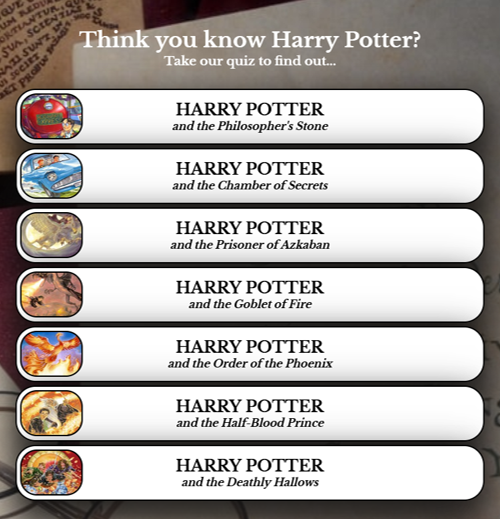 

>I have tried to make the website as intuitive as possible. From the first time the customer navigates to the home page I have tried to make it so the customer is aware straight away of the function of the website by including a relevant website title and cover text to exaplain what the website is for. As soon as the customer navigates to the home page, the things they should see are as follows: The title: "Think you know Harry Potter?", "Take our quiz to find out...", The background image and the navigation links. All of these elements point towards the theme of the website - a Harry Potter Quiz. I feel I have succeeded in this area as I had a number of focus groups divided by age all of which found the site easy to navigate, highly intuitive and knew the exact function of the website at first navigation.  

<em>"I want to have easiliy accessible social media platform links"</em> 
 

>The social media links in the footer of the main page would allow the user to navigate away from the Harry Potter Quiz website and to affiliated social media platforms, these could contain further information about the quiz, give people an opportunity to discuss questions and their answers, and perhaps allow users the opportunity to submit their own questions. This goal was met by placing the social media links within the footer and setting the position to fixed always at the bottom, that way it is always visible on top of other page elements.</em> 

<em>"I want to have a visual aid to confirm which answer I have chosen"</em> 
 
 

>When the user navigates to any of the quiz pages they will be greeting with 20 questions themed around a particular Harry Potter book (year 1 - 7), for each question there are 4 answer options. On click, the answer the user has selected will change colour to grey with a dark grey border around the edge. On hover, the answer will change colour to light grey (see video and image above). I feel that this goal was met as the user has a visual identifier to show which answer they have selected and which answer they could potential select. Having the neutral colour of grey keeps gives no idication of whether the answer is correct or incorrect.</em> 

<em>"I want to get a score at the end of each quiz to show how well I did"</em> 
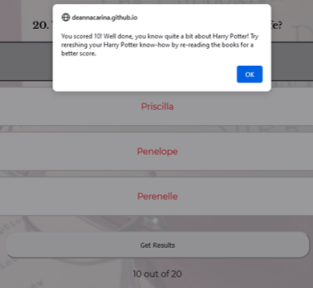 

>When the user clicks on 'get results' an alert box will appear with the user's score and a short personal message generated via the linked JavaScript file. The score will also appear below the 'get results' button. This goal has been met as users have two visual opportunities to know what they scored on the quiz. Ideally I would also have had a score on the index page for each quiz the user carries out, however I don't currently have the coding knowledge to be able to implement this feature - I still feel the goal has been achieved without this.</em> 

<em>"I want to have an option to show the correct answers in case I don't want to see them and want to retry, or want to retry with some help"</em> 
 

>When the user clicks on 'get results' three further buttons appear below the users score: 'reveal answers', 'home' and 'retry'. I wanted the correct answer being revealed to be an option, not a guarentee. User's may want to see their score and retry without seeing the correct answers t0 see if they can improve, and other may want to see the correct answers and then try a different quiz - I wanted this to be a choice for the user. As such I feel that this goal has definitely been met.</em> 

<em>"I want to have interesting and obscure questions about areas of Harry Potter that might not be well-known"</em> 
 

>As I have found, written and developed the questions myself, as well as generated all of the incorrect answers, I have been able to make questions harder by adding in answers that could also be percieved as correct. The image above shows one of the questions asking about the text on the Mirror of Erised. The correct answer looked to be written in a Latin based language, therefore the other 3 incorrect answers I also wrote in Latin to make them also seem plausable. I feel that this goal has been met as I have found all of the questions myself and have been able to pick out facts from the books that are less known. The only downside has been that I have had to re-read the books myself and a lot of the development time has been spent generating questions and answers.</em> 

<em>"I want to have straightforward and easily accessible instructions for the Quiz"</em> 
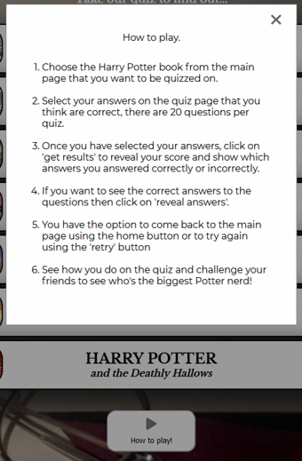 

>On the main page there is an easily accessible button below the quiz links for the user to press which says 'how to play' the wording is straightforward and immediately lets the user know what the button does. The instructions will be brought up in a box (modal) on the index page with simple instructions explaining what the user has to do to be able to get a quiz score. I felt that having the instructions on the same page (in a modal) was better for user experience as they do not navigate away from the main page. Therefore I feel that this goal has been met.</em> 

<a href="#Contents">Back to the top.</a>

### Code Validation
Below are the validation reports for all HTML pages, the CSS file and two reports carried out on the JavaScript. All came back with no errors apart from the Beutify report on the JavaScript which states "'displayTicks' is defined but never used." however the displayTicks function is used but it is called from within the HTML file.  
<strong>HTML</strong> 
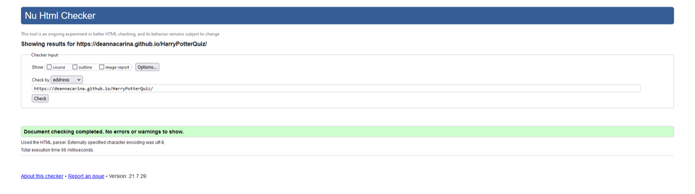  
  
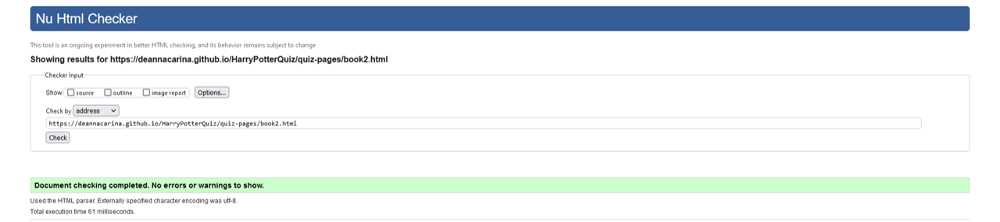  
  
  
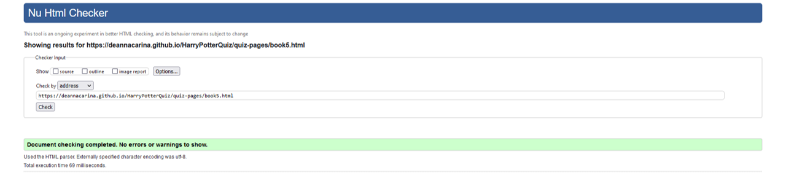  
  
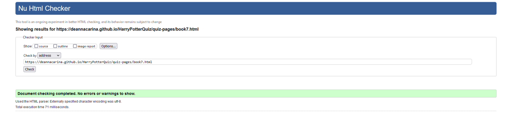  
<strong>CSS</strong> 
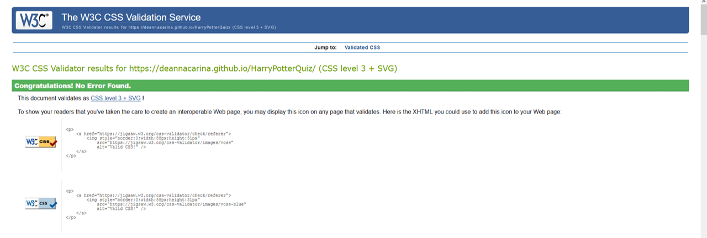  
<strong>JS</strong> 
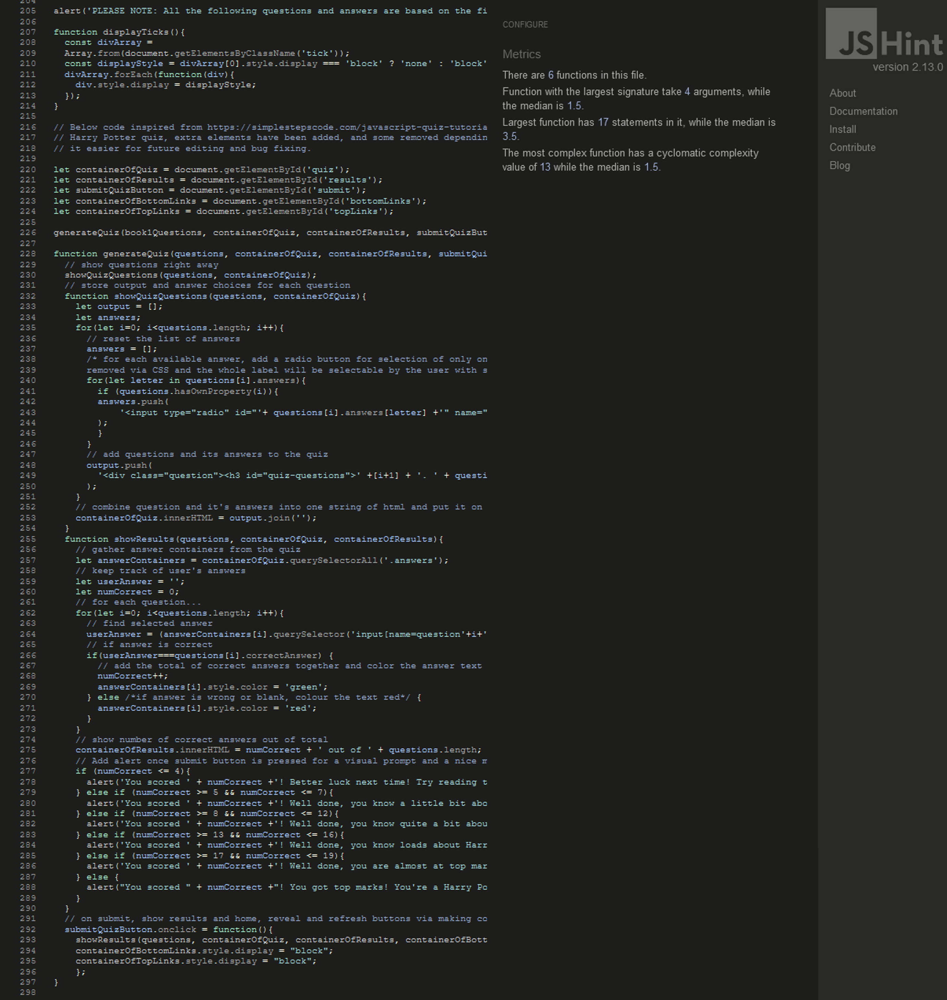  
  
<a href="#Contents">Back to the top.</a>

### Peer Review
As a students of Code Instutute we have Slack as a resource to help and compliment our learning. We are able to post our web pages and GitHub repositories for other students to review. I would like to thank SuzyBee, John R and SimonV_alumni for taking the time to look at my website and for pointing out some of my mistakes and offering guidance and suggestions to improve the website. All problems identified by my peers were rectified straight away.

### Development Problems
Due to the limitations of my own knowledge and coding ability, I found it quite difficult to make some of my ideas a reality - as identified in 'features left to implement' there were things that I would have implemented but my coding knowledge just wasn't high enough. Thoughout the development process, my lack of knowledge and (to a point) my lack of confidence meant that some of the ways I have written the code haven't been ideal. You will be able to see that I have eight separate JavaScript files - this is obviously not following the 'don't repeat yourself' principle and so is not industry standard, however I really struggled to condense my code and have it all work from a single JavaScript file. Please see 'bugs (and their fixes)' for more details on problems that occured during development.

### Accessibility
<em>"By making your website accessible, you are ensuring that all of your potential users, including people with disabilities, have a decent user experience and are able to easily access your information.  By implementing accessibility best practices, you are also improving the usability of the site for all users." [4]</em>

Due to the importance and necessity of accessibility on websites, I have chosen to run all the web pages associated with Harry Potter quiz through the <a href="https://wave.webaim.org/" target="_blank">Wave Accessibility</a> tool. I found from carrying out accessibility checks on my last project that the Wave Accessibility tool is a very good all-round checker that looks at a range of aspects on a web page and shows which aspects need fixing or altering in line with accessibility best practices. The steps I took from first check to last check are as follows:
<ol>
    <li>Run the web page through the <a href="https://wave.webaim.org/" target="_blank">Wave Accessibility</a> tool</li>
    <li>Rectify any errors that resulted from the <a href="https://wave.webaim.org/" target="_blank">Wave Accessibility</a> check regarding code errors and contrast errors</li>
    <li>Re-run the web page through the <a href="https://wave.webaim.org/" target="_blank">Wave Accessibility</a> tool</li>
</ol>

#### index.html
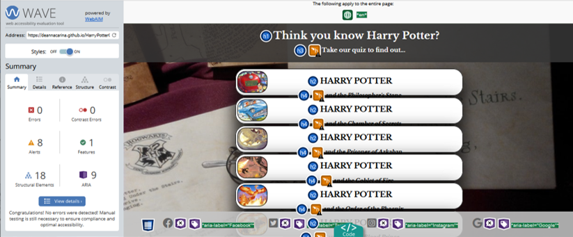

><strong>BEFORE ERRORS FIXED: </strong>Contrast errors on page heading "Think you know Harry Potter? Take our quiz to find out..." 
><strong>HOW ERRORS FIXED: </strong> Set background colour to transparent dark grey and set width of heading to 100% so the background spans the full width of the users device screen.

#### book1.html
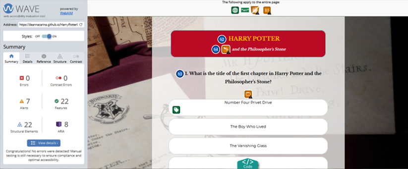

><strong>BEFORE ERRORS FIXED: </strong>No text within the 'reveal answers', 'back to home' or 'retry' buttons. 
><strong>HOW ERRORS FIXED: </strong>Set aria-label to descibe the button.

#### book2.html

><strong>BEFORE ERRORS FIXED: </strong>No text within the 'reveal answers', 'back to home' or 'retry' buttons. Color contrast errors in heading of page. 
><strong>HOW ERRORS FIXED: </strong>Set aria-label to descibe the button. Difficult to fix contrast errors due to text being red and background being blue - set text to white with a red shadow to try and still tie in with the colour scheme.

#### book3.html
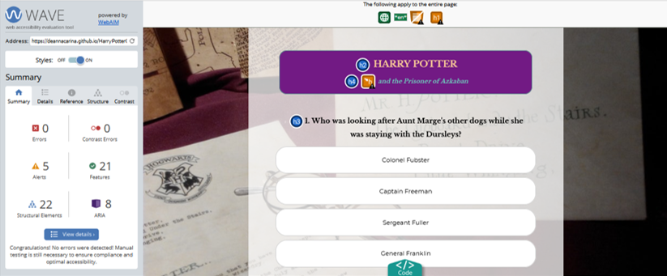

><strong>BEFORE ERRORS FIXED: </strong>No text within the 'reveal answers', 'back to home' or 'retry' buttons. 
><strong>HOW ERRORS FIXED: </strong>Set aria-label to descibe the button.

#### book4.html
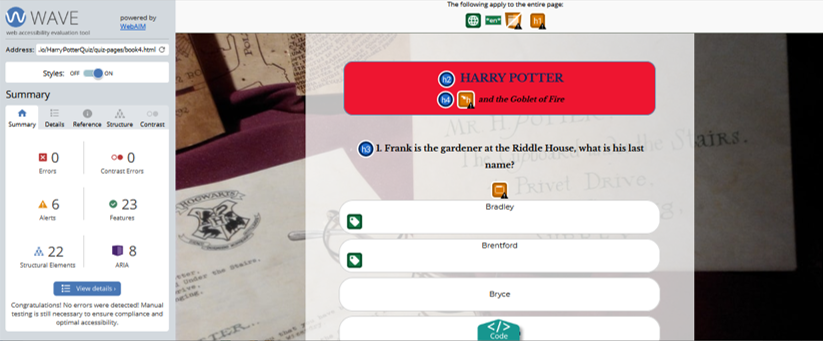

><strong>BEFORE ERRORS FIXED: </strong>No text within the 'reveal answers', 'back to home' or 'retry' buttons. 
><strong>HOW ERRORS FIXED: </strong>Set aria-label to descibe the button.

#### book5.html

><strong>BEFORE ERRORS FIXED: </strong>No text within the 'reveal answers', 'back to home' or 'retry' buttons. 
><strong>HOW ERRORS FIXED: </strong>Set aria-label to descibe the button.

#### book6.html
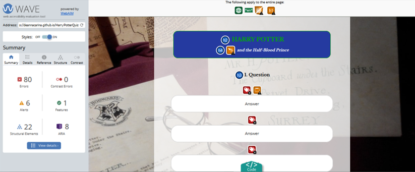

><strong>BEFORE ERRORS FIXED: </strong>No text within the 'reveal answers', 'back to home' or 'retry' buttons. 80 errors due to answers not being in place. 
><strong>HOW ERRORS FIXED: </strong>Set aria-label to descibe the button. These errors will be rectified when all answers are put into the page, currently as all answers are the same, all ID's and form labels are also the same. (See below for updates accesibility report after questions and answers were inputted): 

#### book7.html
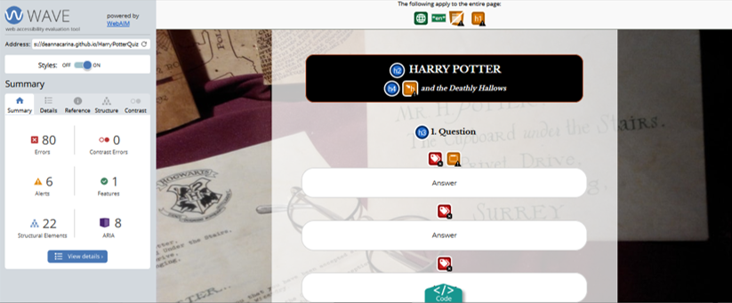

><strong>BEFORE ERRORS FIXED: </strong>No text within the 'reveal answers', 'back to home' or 'retry' buttons. 80 errors due to answers not being in place. 
><strong>HOW ERRORS FIXED: </strong>Set aria-label to descibe the button. These errors will be rectified when all answers are put into the page, currently as all answers are the same, all ID's and form labels are also the same. (See below for updates accesibility report after questions and answers were inputted): 

#### 404.html
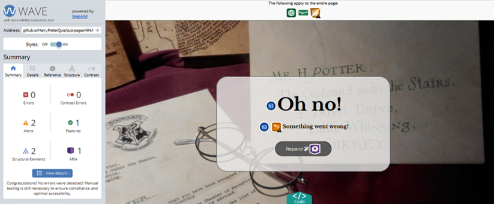

><strong>BEFORE ERRORS FIXED: </strong>No errors. 
><strong>HOW ERRORS FIXED: </strong>No errors.

 <a href="#Contents">Back to the top.</a>

### Performance Testing
Below is the report generated from lighthouse via Chrome DevTools for the desktop website, I am extremely happy with this result, and don't feel I need to make any changes.
  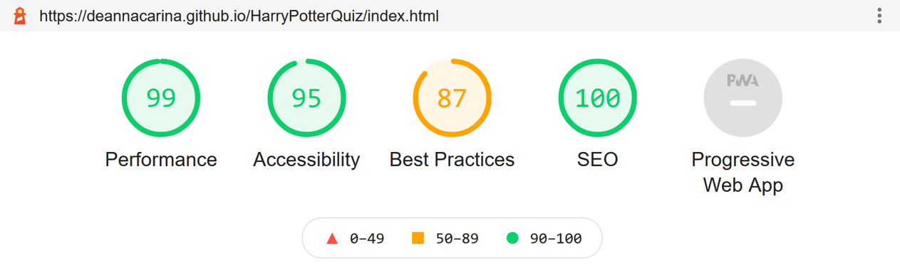  
Below is the report generated from lighthouse via Chrome DevTools for the mobile website, I am also happy with this result, and don't feel I need to make any changes.
    

### Bugs (and their fixes)
<ul>
    <li>Unable to duplicate answers within the same JS file due to using the answers themselves as selector ID's. In order to make the answers selectable, each one had to have a unique ID - I found the easiest way to generate these unique ID's was to make the answer themselves the ID, however I found that when I did this, if there were duplicate answers in the quiz, the duplicate answer would be selected when the orginal answer was selected. To minimise the risk of this happening, I chose to split the JavaScript files containing the questions and answers into seven separate files as the chances of duplicating answers over 20 questions is far less than the chances of duplicating them over 140. I am aware that I am not following the DRY (don't repeat yourself) priniciple when I do this, however to minimise bugs, and to fix bugs that arose in the development of the website, I found that I actually preferred having these separate JavaScript files as I knew exactly where the bug would be and how to fix it.</li>
    <li>User can scroll to the bottom of the quiz page as soon as they navigate to it, click on 'Get results' which will return a score of 0/20, then click on 'Reveal answers' which will reveal all the correct answers, the user can then change/select their answers and re-submitt for a top score. To fix this there is the option to disable interaction with the answers after the 'get results' button is clicked, however I feel that there's not much point in doing this as users can cheat regardless of whether they can re-submit or not. If the answers were disabled on click of 'get answers' then all the user would need to do is note down the questions they got wrong with the correct answers, then re-try the quiz. Unfortunately there will always be people that cheat, and there isn't much that we can do about this, however I am hoping that the people that this quiz is targetted towards would complete the quiz without cheating for the personal satisfaction of knowing they have top-knowledge of the Harry Potter books.</li>
</ul>
<a href="#Contents">Back to the top.</a>