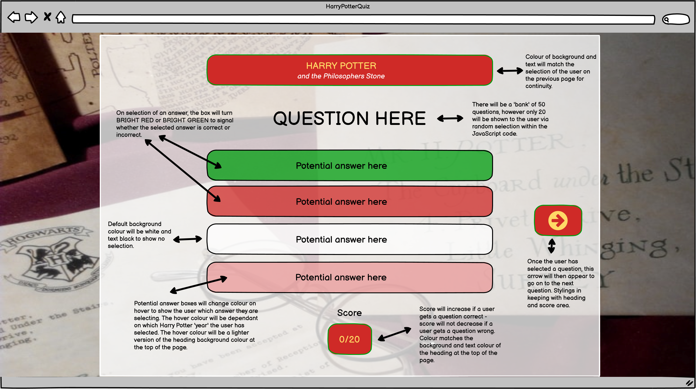
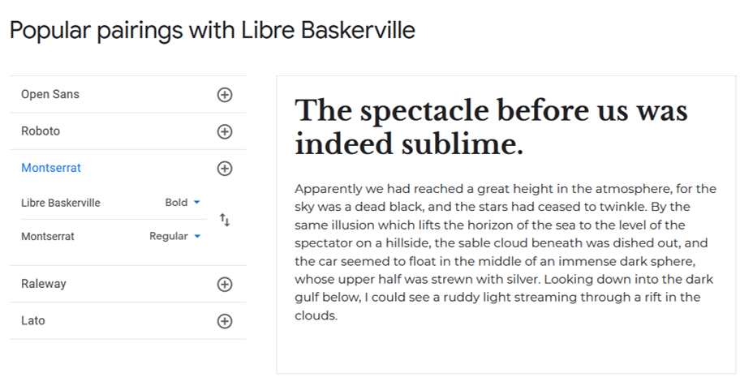
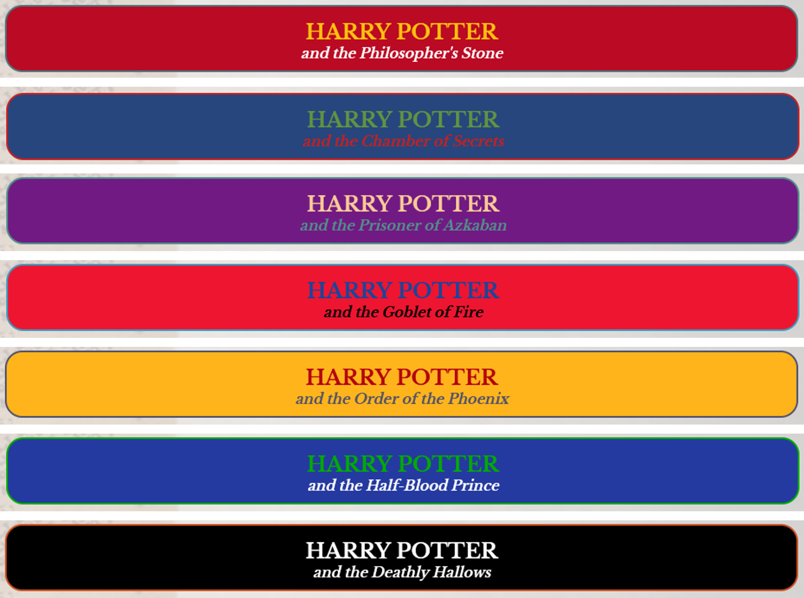
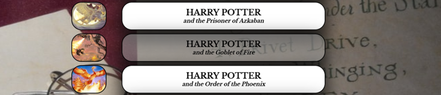

# UX
### Introduction
The five planes provide a conceptual framework for breaking down the task of designing experiences into component elements so that we can understand the problem as a whole. I used this framework for my first Portfolio Project for Code Institute and found it to be structured, easy to follow and helped in breaking down the tasks needed to design and implement a user friendly and interactive website; therefore I will be using the same framework again to design and implement this project.
### Strategy
#### Vision
The Harry Potter Quiz is an interactive website focusing on the more obscure facts and details of the Harry Potter books that only the more 'dedicated' fans would know.
The Harry Potter franchise has a huge and dedicated fan-base, the term 'Pottermania' was a term first used around 1999 to describe the craze that Harry Potter fans have had over the series [1], and 'Potterheads' has also become a term used by many to describe diehard fans of the series. According to Mugglenet, there have been more than 500million Harry Potter books sold worldwide [2], which means that at least one in 15 people in the world owns at least one Harry Potter book. As a huge Harry Potter fan myself, I have looked online for quizzes to test my Harry Potter knowledge, and have found myself dissapointed at the lack of challenge they give! When you consistely score 100% on every Harry Potter quiz you find, the challenge rather becomes to find a quiz that will <strong>ACTUALLY</strong> challenge you. Therefore I hope this web-quiz will appeal to those 'Potterheads' that want to challenge themselves and test whether they really do 'know Harry Potter'.

#### Aims
<ol>
    <li>To supply instructions to the user on how to best 'play' the quiz</li>
    <li>For visitors to the website to have a positive user experience, in terms of website design and interactivity</li>
    <li>To be easily find-able via search engines</li>
    <li>To educate users on the more unusual facts around the Harry Potter books</li>
    <li>To encourage users to re-read the Harry Potter books and increase their knowledge</li>
    <li>To make the site intuative and easily usable to enable customers learn about Harry Potter</li>
    <li>To have easiliy accessible social media platform links</li>
</ol>

#### Target Audience

There are a number of target audiences for this website due to the diverse nature of the Harry Potter fanbase. Harry Potter is considered one of the few four-quadrant, multi-generation spanning franchises that exist today [3] according to the Hollywood Movie Industry, which means that it appeals to:

<ul>
    <li>Males</li>
    <li>Females</li>
    <li>Under 25s</li>
    <li>Over 25s</li>
</ul>

This four-quadrant theory means that I must make the web-quiz accessible to everyone, and have it appeal to anyone that visits no matter their age, gender, ethnicity, or other demographic characteristics and features, as anybody can be a fan of Harry Potter.

#### User Stories

<strong>As a new AND returning user I want to...</strong>
<ul>
    <li>Know the purpose of the website as soon as I navigate to the home/landing page</li>
    <li>Navigate the website quickly and effectively</li>
    <li>Quickly find the relevant quiz I wish to attempt</li>
    <li>Have a visual aid to confirm which answer I have chosen</li>
    <li>Get a score at the end of each quiz to show how well I did</li>
    <li>Have an option to show the correct answers in case I don't want to see them and want to retry, or want to retry with some help</li>
    <li>Have interesting and obscure questions about areas of Harry Potter that might not be well-known</li>
    <li>Have straightforward and easily accessible instructions for the Quiz</li>
</ul>

<strong>As the business operator I want to...</strong>
<ul>
    <li>Ensure the website is easily maintainable by software developers by having intutitive and neat code</li>
    <li>Have any media content displayed in the website accessible at all times via a linked file system</li>
    <li>Ensure all navigation links (internal or external) are always fully functional for ease of use</li>
    <li>Ensure the website is fully accessible to users that may have visual imparement</li>
    <li>Stand out from other forms of online Harry Potter quiz, by being easy to use and well-structured</li>
</ul>

#### What's in and what's out?

<table>
    <tr>
        <th>Opportunity/Feature</th>
        <th>Feasibility/Viability (score out of 5)</th>
        <th>Level of Importance (score out of 5)</th>
        <th>In or out?</th>
    </tr>
    <tr>
        <td>Obvious role of the website demonstrated with hero image and capture text</td>
        <td>5</td>
        <td>5</td>
        <td>In</td>
    </tr>
    <tr>
        <td>Simple design with straightforward navigation to make it easier for the user to understand where to find information</td>
        <td>4</td>
        <td>5</td>
        <td>In</td>
    </tr>
    <tr>
        <td>A highly visually interactive website to keep the user interested</td>
        <td>5</td>
        <td>4</td>
        <td>In</td>
    </tr>
    <tr>
        <td>A Fully accessible website able to be experienced by customers with visual imparement</td>
        <td>4</td>
        <td>5</td>
        <td>In</td>
    </tr>
    <tr>
        <td>A way for users to see which answer they have selected</td>
        <td>4</td>
        <td>5</td>
        <td>In</td>
    </tr>
    <tr>
        <td>A way for users to see the score they have recieved for each quiz</td>
        <td>4</td>
        <td>5</td>
        <td>In</td>
    </tr>
    <tr>
        <td>A way for users to see the correct answers should they wish</td>
        <td>3</td>
        <td>4</td>
        <td>In</td>
    </tr>
    <tr>
        <td>A score table on the main page for users to see their score from each quiz on the same page</td>
        <td>2</td>
        <td>3</td>
        <td>Out</td>
    </tr>
    <tr>
        <td>A one-page site with all quizes on the same HTML page with changes made entirely via JavaScript</td>
        <td>1</td>
        <td>2</td>
        <td>Out</td>
    </tr>
    <tr>
        <td>A fully responsive website that works on a range of screen sizes and devices</td>
        <td>5</td>
        <td>5</td>
        <td>In</td>
    </tr>
    <tr>
        <td>A range of questions from all Harry Potter books that would not usually feature in the standard Harry Potter quizes found online</td>
        <td>3</td>
        <td>4</td>
        <td>In</td>
    </tr>
    <tr>
        <td>For each question, a range of answers that would all make sense to the user (nothing obscure)</td>
        <td>3</td>
        <td>3</td>
        <td>In</td>
    </tr>
    <tr>
        <td></td>
        <td>Average Viability x number of features: 43</td>
        <td>Sum of Importance: 50</td>
        <td></td>
    </tr>
</table> 
As we can see from the table above, the importance is higher than the viability, which which means that I may run into some problems during the implementation of the web-quiz a there will be things that I would like to implement but I would not have the means or knowledge to implement them. Therefore the web-quiz will take a more basic layout, and I will work within the confines of my very limited JavaScript Knowledge to acheive the main goals I have set myself.  
I have plotted the table above into a graph to easily visualise the features that will be implemented into the website and which ones won't be:
<ul>
    <li>The features in the pink section will be implemented</li>
    <li>The features in the grey section could be implemented at a later date but aren't necessary right now</li>
    <li>The features in the turquoise section will not be implemented as it would be unwise to focus on these features until a later date</li>
</ul>

 
For the feature "For each question, a range of answers that would all make sense to the user (nothing obscure)" I am going to aim to implement this feature as this will add to the user experience but also allow me to make the question harder or easier depending on the possible answers there are. For example in Book 1 question 19, I have custom made the answers to all make sense as they are all written in Latin (apart from the correct answer however this also looks like it's written in latin) and all translate to something that would make sense as the answer to the question.
 
<a href="#Contents">Back to the top.</a>

### Scope

Much the same as my previous project for Code Institute, I have chosen to base the development of my product using the MMP (Minimum Marketable Product) as this allows a fully functional application to be used and can implement my aims with the minimum amount of features while still being completely usable.

This however does mean that more time must be spent developing and deploying the application without the guarantee of user satisfaction and possibly result in some 'rough edges' that need to be rectified and de-bugged at a later date. By using this method, any feedback from users will be based on a fully working web-app and result in fully qualitative data due to the product being in a finished state; rather than feedback based on a web-app that has intentionally been left incomplete resulting in feedback from users who may believe the site to be inadaquate due to lack of content and intuitiveness. I have been able to confidently use the MMP model due to my own interest and love for the Harry Potter franchise as well as ownership of all of the Harry Potter books to be able to create the questions and answers for the quiz, I can create the web-quiz based on what I would want as a Harry Potter fan. By incorporating into the website features that I would want to see on web-quizes based on the Harry Potter books, I hope that my wants and needs will translate to the wants and needs of the users and fans visiting the Harry Potter quiz website. 
 
The MMP model will:
<ul>
    <li>Create a clear website with enough content for the users wants and needs to be fulfilled</li>
    <li>Allow me to work within the scope of my abilitiy while also allowing me to challenge myself in areas of coding that I'm not as comfortable with</li>
    <li>Result in a website with high levels of UX</li>
</ul>
While following the MMP model, to meet the user and business goals, my website will include:
<ul>
    <li>A large collection of Harry Potter related questions based on the Harry Potter books</li>
    <li>A straightforward and intuitive navigation system for users to be able to navigate to specific quizzes</li>
    <li>A way for users to find out their score after carrying out a quiz</li>
    <li>A way for users to reveal the correct answers and to easily re-try</li>
</ul>
<a href="#Contents">Back to the top.</a>

### Structure

Much the same as my last project for Code Institute, I have chosen to carry out a non-linear method of design for this website as it consists of multiple pages which might not necessarily be viewed in a particular order as each page has a different role to play. By having multiple pages we can separate large amounts of information into logical sections to make it easier for the user to find what they are looking for. 

On index.html: I chose for the main content of this page to be navigation for the user to be able to select a particular Harry Potter quiz. If the navigation was less obvious then the user might navigate away as they don't know where to click or what to do. The text at the top of the page tells the user the exact role of the website and the topic of the quiz while also issuing a challenge for the user and encouraging them to carry out one of the seven quizzes. This page also contains a button which will show instructions for the user and a footer containing social media links.

On all of the quiz pages: On navigation to all of the quiz pages, an alert will be visible for the user reminding them that all of the questions are based on the Harry Potter books, I felt this was a highly important piece of information for the user to know as many of the potential answers differ based on the Book versus the Movie e.g. Book 1 Question 15: The correct answer for the Book is 'Charms' however the correct answer for the movie is 'Defence Against the Dark Arts' both are potential answers for the question so this question might have caught out many users without the alert. All questions are displayed on the page via the specific JavaScript file, on selection of a single answer, the users selection will highlight in a grey colour, and on hover of any answer it will highlight in a light grey colour. Once all questions have been attempted (or not) and the user selects 'get results' all potential answers for a single question will be highlighted in green or red - this does not show the correct answer, only whether the question has been answered correctly or incorrectly. On selection of the 'get results' button, this will also reveal three further buttons - one to reveal the correct answers, one to refresh the page to try again, and one to go back to the home page (there is also this button at the top of the page). 
<a href="#Contents">Back to the top.</a>

### Skeleton

The wireframes for the Harry Potter Quiz website were made with the Balsamiq Desktop Applictaion, they can be found by viewing the images below. As the layout of the quiz will change between device screen sizes, I have made a wireframe for all devices; with PC being in landscape, and tablet and phones being in portrait orientation. As I have chosen an image that is square, it is able to act as the background for all screen sizes, inkeeping with device compatibility and responsiveness. As the development of the web-quiz is carried out, the final produced developed may differ from these wireframes as I decide which features to implement.
  
The wireframe below is for the landing page on PC.
  
The wireframe below is for the quiz page on PC.
  
The wireframes below are for tablets. 
 
  
The wireframes below are for smaller devices. 
 

 
<a href="#Contents">Back to the top.</a>

### Surface
#### Typography
I used Google Fonts to find the typography that I wanted to use for the website. I wanted to try and find a similar font for the headings as the font for the 'Harry Potter' text on the front covers of the books, I think I managed to find a fairly similar font with 'Libre Baskerville', by using this font I hope that it will add familiarity for the user, but also highlight the design similarities between the website and the books. For the normal website text I used 'Montserrat', this was a font suggested by Google Fonts which I felt was good for the website as it is easy to read. I didn't come across any problems with these fonts during the design and deployment processes.  
  

#### Colour Scheme
 
The main colours used on the website are the headings and navigation links on click of the 'get results' button - these correspond to the colours on the front of the related Harry Potter book.  
  
Initially (as you can see from the wireframes) I had chosen to have the links with these specific colours too, in able to add familiarity for the user, however I felt that having so many colours on the main page would distract the user and encourage them to navigate away due to information overload. As such, I have made the div-links to the quiz pages very neutral in colour and added an image to the left hand side of the nav-link of the front cover image of each Harry Potter book. I generated the colours above by using an eyedropper tool on the front covers of the book images below. Unfortunately due to accessibility constraints, I did have to minimally alter a few of the HEX values above to ensure there was enough contrast between background and overlying text, the place where this is most prevelant is in the title of the Book2 Quiz (Harry Potter and the Chamber of Secrets) it was very difficult to get a compliant result due to having a blue background and red overlying text - for how I fixed this please refer to the Testing (accessibility) section. 
 
On hover of the answers, the colour changes to a light grey as a visual aid to the user of which answer they are going to click (this can be seen with the first image below), and on click of an answer the background colour goes to a darker grey with a dark grey border as a further visual aid of which answer they have selected - I chose to keep these colours neutral so there is no visual clue as to which answer is correct. The quiz pages all have a transparent background behind the answers to ensure the user is not distracted by the background. I also added a hover psuedo class to the nav links on the main page as a visual aid to which quiz the user is going to click on. 
  
 

#### Icons
The icons used in the website were taken from <a href="https://fontawesome.com/" target="_blank">Font Awesome</a>, they can be seen throughout the site on all quiz pages after the 'get results' button has been clicked. They are used as calls to action for the user to either navigate home, refresh the page or to reveal answers.  
  
The favicon was made by myself using shapes and drawing tools in Microsoft Powerpoint, it was then converted from a png file to an ico file via <a href="https://favicon.io/" target="_blank">Favicon.io</a>.  
 
<a href="#Contents">Back to the top.</a>

#### Design - Images
The main image used on the website is the background image which was taken from Pexels (see credit for photographer information). I wanted a background that would tie in with the theme of the website and also be instantly recognisable by the users. I struggled to find an image that fit my needs while also being fairly neutral in colour so as to not distract from the forground text and elements.   
 
I feel that this image was the best I could find, and to ensure that there is less distraction from it, on the quiz pages I have a white transparent overlay of the majority of the background to enable the user to still see the image without being distracted by it. The only other images used on the website are those of the front cover images on the main page, these were scanned using my home scanner and reduced in size via an image resolution reduction tool online to reduce load times.  
 
<a href="#Contents">Back to the top.</a>